# 01_MASTER_KNOWLEDGE_GRAPH — الخريطة الرئيسية للمعرفة
**PHASE 3 — KNOWLEDGE GRAPH** · يُبنى فوق `01_KNOWLEDGE_BASE` (142 مدخلًا) **دون تعديله**.
**الملفات المرافقة:** `02_CONCEPT_RELATIONSHIPS.csv` (العلاقات) · `02b_GRAPH_NODES.csv` (العقد) · `03_BOOK_CROSSWALK.md` · `04_LEARNING_DEPENDENCIES.md` · `05_DARK_EQ_DEFENSIVE_GRAPH.md` · `06_ATTAMAN_CASE_GRAPH.md` · `07_GRAPH_QA_REPORT.md` · `08_STORY_ARCHITECTURE.md` · `09_RETENTION_ARCHITECTURE.md`

---

## 0. لماذا خريطتان؟
بحسب التوجيه الرئيسي الجديد، **المعلومة وقود وليست المنتج**. لذلك تُبنى في هذه المرحلة خريطتان متوازيتان:

| | **GRAPH A — خريطة المعرفة** (هذا الملف + 02–07) | **GRAPH B — خريطة القصة** (08 + 09) |
|---|---|---|
| السؤال | كيف ترتبط المفاهيم علميًا وتعليميًا؟ | متى وكيف **يكتشف المشاهد** المفهوم؟ |
| الوحدة | عقدة مفهوم (N##) + علاقة (R###) | مشهد (S#.#) داخل فصل درامي (ACT) |
| معيار النجاح | كل علاقة لها دليل ومصدر وتصنيف | «هل سيكمل المشاهد الفرجة؟» |
| الرابط بينهما | عمود **STORY_SCENE** في `02b_GRAPH_NODES.csv` — كل عقدة لها موقع معرفي وموقع قصصي | عمود **CONCEPT DISCOVERED** في 08 يحيل إلى N## |

> **القاعدة:** لا توجد عقدة في خريطة المعرفة تُعرض في الحلقة لأنها «مهمة» فقط؛ تُعرض إذا خدمت مشهدًا. والمعلومة التي لا مشهد لها تبقى في المكتبة.

---

## 1. مفتاح القراءة

### 1.1 أنواع العقد (يجيب عن السؤال 7: مهارة عملية أم نموذج تفسيري؟)
| النوع | المعنى | العدد |
|---|---|---|
| MODEL | نموذج تفسيري (يشرح لماذا/كيف) | 32 |
| SKILL | مهارة عملية يمكن التدرب عليها | 33 |
| DEF_SKILL | مهارة دفاعية (كشف/حماية) | 10 |
| PATTERN | نمط سلوكي يُتعرَّف عليه (لا يُعلَّم كطريقة) | 13 |
| FRAME | إطار من تصميم المشروع/الـBrief | 14 |
| CASE | حالة درامية خيالية | 1 |

### 1.2 مجالات العقد (يجيب عن السؤالين 8 و9)
| المجال | المعنى | العدد |
|---|---|---|
| HEALTHY | ذكاء عاطفي صحي (فهم، تعاطف، تواصل، احترام) | 17 |
| DEFENSIVE | وعي دفاعي (كشف، حماية، حدود) | 32 |
| SHARED | أساس يخدم المسارين (وعي، تسمية، وقفة، حقائق) | 44 |
| FRAMEWORK | خطوات النظام النهائي وخطة الأيام السبعة | 10 |

### 1.3 وسوم العقد (يجيب عن السؤال 10: ما هو تركيب المشروع؟)
| الوسم | المعنى | العدد |
|---|---|---|
| DIRECT_SOURCE | المفهوم من كتاب واحد بالصفحة | 40 |
| CROSS_BOOK | المفهوم موجود مستقلًا في أكثر من كتاب (دُمج في عقدة واحدة، والمراجع محفوظة) | 48 |
| INTEGRATED_SYNTHESIS | عقدة من تصميم المشروع (مثل «Dark EQ» والمساران) | 3 |
| USER_FRAMEWORK | من إطار الـBrief (الخطوات التسع، الدرع، خطة 7 أيام) | 11 |
| FICTIONAL_CASE_STUDY | شخصية درامية (عتمان) | 1 |

### 1.4 تصنيف العلاقات
| التصنيف | المعنى | العدد |
|---|---|---|
| [DIRECT_SOURCE_RELATIONSHIP] | العلاقة نفسها مذكورة في مصدر (مع الاقتباس أو الصفحة في عمود EVIDENCE) | 89 |
| [CROSS_BOOK_PARALLEL] | مفهومان متشابهان أو متكاملان في كتابين **دون** أن يقتبس أحدهما الآخر | 23 |
| [CROSS_BOOK_DIFFERENCE] | الكتب تؤطر الآلية بشكل مختلف (D1–D7 + فرق صغير) | 9 |
| [INTEGRATED_SYNTHESIS] | ربط تعليمي من المشروع — **لا يُنسب لمؤلف** | 72 |
| [EXTERNAL_KNOWLEDGE] | لم يُحتج إليه كعلاقة؛ استُخدم مرة واحدة كتحفظ داخل علاقة مرفوضة (X007) | 0 |
| [UNSUPPORTED] | علاقات مقترحة **رُفضت** ومسجلة لبيان السبب | 14 |
| حالة الفيلم (CASE) | ربط ملاحظة من الفيلم بمفهوم — تركيب المشروع + حالة التحقق | 13 |

**أسماء العلاقات المستخدمة:** CAUSES · LEADS_TO · ENABLES · REQUIRES · REINFORCES · EXPLAINS · CONTRASTS_WITH · COMPLEMENTS · APPLIES_TO · PROTECTS_AGAINST · REINTERPRETS · PRACTICES · TRANSITIONS_TO · SYNTHESIZES.

> **قاعدة الإنشاء:** لم تُنشأ علاقة لأن مفهومين «يتشابهان». روابط «Related Concepts» في قاعدة المعرفة (336 رابطًا غير مصنّف) هي روابط تصفح داخلية ولم تُحسب هنا كعلاقات؛ كل علاقة في هذا الملف كُتبت يدويًا بدليل وتصنيف.

---

## 2. الهرم ذو المستويات السبعة (العمود الفقري: Goleman)

| المستوى | الاسم | العقد | عدد | الأنواع |
|---|---|---|---|---|
| 1 | الأساس | N01 المخ الانفعالي — جرس الإنذار (الأميجدالا)، N02 الانفعال: نزوع للفعل + بصمة جسدية، N03 الفكرة التلقائية، N04 الانتباه والطيار الآلي، N05 الوعي الذي يحتوي التجربة، N06 الوعي بالذات، N07 القشرة الأمامية — مفتاح الإيقاف، N08 النموذج الخماسي، N09 الذاكرة الانفعالية والإنذارات القديمة، N10 المشاعر مرشد للقرار | 10 | MODEL:9، SKILL:1 |
| 2 | التنظيم الداخلي | N11 المثيرات، N12 إشارات الجسد المبكرة، N13 التفسير / القصة، N14 تسمية الشعور، N15 الفكرة الساخنة وفحص الدليل، N16 إعادة البناء المعرفي — الفكرة المتوازنة، N17 اليقظة الذهنية، N18 الوقفة — مساحة الاستجابة، N19 التنظيم الانفعالي — اعتدال لا كبت، N20 القبول ليس استسلامًا، N21 حلقات الاجترار والقلق، N22 القلق جهاز إنذار يُضبط، N23 التجنب وسلوكيات الأمان | 13 | SKILL:9، MODEL:4 |
| 3 | فهم الآخر | N24 التعاطف، N25 أخذ المنظور والفضول، N26 الاحتياجات تحت الشعور، N27 مشاعر الآخر — التخمين التعاطفي، N28 الإنصات والتوافق وإعادة الصياغة، N29 الإشارات غير اللفظية، N30 الفهم ليس موافقة، N31 العدوى الانفعالية، N32 أربع خيارات لتلقي كلام سلبي، N33 الشخصنة والتأويل العدائي، N34 الجودو العاطفي | 11 | SKILL:7، MODEL:4 |
| 4 | التواصل | N35 الملاحظة مقابل التفسير، N36 مكونات NVC الأربعة، N37 الطلب مقابل المطالبة، N38 الشكوى لا النقد (XYZ)، N39 التوكيد — الطريق الأوسط، N40 المحادثة الحاسمة، N41 المقابلة (Contrasting)، N42 الهدف المشترك، N43 الأمان النفسي في الحوار، N44 STATE — قول الرأي الصعب، N45 الاعتذار والإصلاح، N46 التقدير الصادق | 12 | SKILL:10، MODEL:2 |
| 5 | الضغط العالي | N47 النوبة الانفعالية (الخطف)، N48 الطوفان، N49 رهان عالٍ + آراء متعارضة + مشاعر قوية، N50 الحوار وحوض المعنى المشترك، N51 الصمت والعنف، N52 ابدأ بالقلب — واختيار المغفل، N53 الوقت المستقطع للعودة، N54 استراحة الـ20 دقيقة (فسيولوجية)، N55 حل النزاع بالاحتياجات، N56 أسلحة جوتمان الأربعة، N57 المثير لا السبب | 11 | MODEL:7، SKILL:4 |
| 6 | الوعي الدفاعي | N60 «Dark EQ» — إطار دفاعي من تصميم المشروع، N61 ازدواجية استخدام المهارة الاجتماعية، N62 الانفعال المصطنع كرافعة، N63 التخويف المحسوب، N64 السلطة المرهبة تُسكت الناس، N65 الذنب كأداة ضغط، N66 سحب الاهتمام كتهديد، N67 المديح المتلاعب، N68 لغة السلطة والغطاء الأخلاقي/الديني، N69 التلون الاجتماعي — القول غير الفعل، N70 خلق الاعتمادية، N71 صمت الشهود وإيقاع الجماعة، N72 العقاب حسب المزاج، N73 ألعاب الكلام، N74 إسكات الضمير بالتبرير، N75 الامتثال تحت الضغط ليس موافقة، N76 العجز وفقدان السيطرة، N77 النمط مقابل الواقعة، N78 معايرة الرادار — لا سذاجة ولا بارانويا، N79 التوثيق، N80 الحدود — ليست عدوانًا، N81 القوة الحامية واختبار النية، N82 الحماية: دعم، تصعيد، استعادة السيطرة، مسافة، N83 حدود إعادة التأطير — الإساءة لا تُعالج بالتفكير، N84 الغضب الصحي كإشارة — وغيابه مشكلة، N85 لوم الذات وفطيرة المسؤولية، N86 صف السلوك ولا تشخّص، N87 الإفصاح الانتقائي الآمن، N88 لا تدخل لعبة الانفعال، N89 سلطتك الداخلية، N90 الاستقامة العاطفية — الأمانة والتكامل، N91 درع Dark EQ، N92 حالة عتمان (شخصية درامية) | 33 | FRAME:2، MODEL:6، PATTERN:13، DEF_SKILL:10، SKILL:1، CASE:1 |
| 7 | التكامل | N93 NOTICE — لاحظ، N94 NAME — سمِّ، N95 PAUSE — توقف، N96 UNDERSTAND — افهم قصتك، N97 REGULATE — نظّم، N98 EMPATHIZE — تعاطف، N99 COMMUNICATE — تواصل، N100 NAVIGATE — أدِر، N101 REFLECT — راجع، N102 الممارسة المتدرجة — مراحل المهارة، N103 خطة الأيام السبعة، N104 مسار الذكاء العاطفي الصحي، N105 المسار الدفاعي | 13 | FRAME:12، SKILL:1 |

**ملاحظة ربط بمستويات الطلب:** «الضغط» و«التأثير القائم على الخوف» و«انتهاك الحدود» في المستوى 6 ليست عقدًا مستقلة بل **مجموعات**: الضغط = N62–N75؛ التأثير بالخوف = N63، N64، N72؛ انتهاك الحدود = N75 + N80. «الوقفة التكتيكية» = نفس العقدة N18 مطبقة في المسار الدفاعي (R: N18 APPLIES_TO N105) — لم تُنشأ عقدة مكررة.

### 2.1 خريطة الهيكل — العلاقات المحورية فقط
*(الخريطة الكاملة = الجدول في `02_CONCEPT_RELATIONSHIPS.csv`. هنا ~40 علاقة تحمل منطق الحلقة. الخط المتصل = مصدر مباشر؛ المتقطع = موازاة بين كتب؛ المنقط بعلامة ✕ = اختلاف حقيقي؛ الرمادي = تركيب المشروع.)*

```mermaid
flowchart TB
  subgraph L1["المستوى 1 — الأساس (Goleman ق1)"]
    N01[جرس الإنذار<br/>الأميجدالا]; N02[الانفعال<br/>نزوع للفعل]; N07[القشرة الأمامية<br/>مفتاح الإيقاف]; N09[الذاكرة الانفعالية]; N06[الوعي بالذات]; N03[الفكرة التلقائية]
  end
  subgraph L2["المستوى 2 — التنظيم الداخلي"]
    N11[المثيرات]; N12[إشارات الجسد]; N13[التفسير/القصة]; N14[تسمية الشعور]; N15[الفكرة الساخنة والدليل]; N16[الفكرة المتوازنة]; N17[اليقظة]; N18[الوقفة]; N19[التنظيم]
  end
  subgraph L3["المستوى 3 — فهم الآخر"]
    N24[التعاطف]; N25[المنظور والفضول]; N26[الاحتياجات]; N28[الإنصات]; N30[الفهم ≠ الموافقة]
  end
  subgraph L4["المستوى 4 — التواصل"]
    N35[الملاحظة ≠ التفسير]; N36[NVC]; N37[الطلب ≠ المطالبة]; N39[التوكيد]; N42[الهدف المشترك]; N44[STATE]
  end
  subgraph L5["المستوى 5 — الضغط العالي"]
    N47[النوبة الانفعالية]; N48[الطوفان]; N51[الصمت والعنف]; N52[ابدأ بالقلب / و]; N53[الوقت المستقطع]
  end
  subgraph L6["المستوى 6 — الوعي الدفاعي (تركيب المشروع فوق مصادر)"]
    N61[ازدواجية الاستخدام<br/>Gol ص65،167]; N65[الذنب كأداة]; N64[السلطة المرهبة]; N77[النمط ≠ الواقعة]; N78[معايرة الرادار]; N80[الحدود]; N82[الحماية والدعم]; N83[حدود إعادة التأطير]
  end
  subgraph L7["المستوى 7 — التكامل (إطار الـBrief)"]
    N93[NOTICE] --> N94[NAME] --> N95[PAUSE] --> N96[UNDERSTAND] --> N97[REGULATE] --> N98[EMPATHIZE] --> N99[COMMUNICATE] --> N100[NAVIGATE] --> N101[REFLECT]
  end
  N01 -->|CAUSES| N47
  N09 -->|EXPLAINS| N11
  N11 -->|LEADS_TO| N47
  N07 -->|ENABLES| N19
  N06 -->|ENABLES| N24
  N19 -->|ENABLES| N24
  N14 -->|ENABLES| N18
  N13 -->|LEADS_TO| N02
  N03 -->|EXPLAINS| N02
  N35 -->|ENABLES| N15
  N16 -->|PRACTICES| N15
  N16 -->|REQUIRES| N19
  N17 -->|ENABLES| N18
  N18 -->|LEADS_TO| N19
  N12 -.->|PARALLEL| N06
  N18 -.->|PARALLEL| N53
  N30 -.->|PARALLEL| N24
  N37 -->|PRACTICES| N36
  N35 -->|ENABLES| N44
  N52 -->|PROTECTS_AGAINST| N51
  N53 -->|PROTECTS_AGAINST| N48
  N39 -.->|PARALLEL| N52
  N61 -->|REINTERPRETS| N24
  N37 -->|PROTECTS_AGAINST| N65
  N39 -->|PROTECTS_AGAINST| N65
  N64 -.->|PARALLEL| N51
  N15 -->|ENABLES| N78
  N78 -->|REQUIRES| N35
  N83 -->|LEADS_TO| N82
  N39 -->|ENABLES| N80
  N82 -->|REQUIRES| N06
  N77 ==>|SYNTHESIS| N78
  N16 -. "✕ D1" .- N17
  N47 -. "✕ D6" .- N13
  N83 -->|CONTRASTS_WITH| N16
```

---

## 3. إجابات الأسئلة العشرة (مع مؤشرات إلى الأدلة)

**س1 — ما الذي يسبب/يقود إلى ماذا؟** السلسلة الأساسية المدعومة مباشرة:
- المثير (N11) ← الأميجدالا (N01) ← النوبة (N47) [Goleman ص31، 41، 47 — R001، R005].
- التفسير (N13) ← الشعور (N02) [MoM p.16 — R021].
- الانفعال الشديد ← تجمد التفكير (N47 → N10) [Goleman ص48–49، ص118 — R008].
- النقد والاحتقار ← الطوفان (N56 → N48) [Goleman ص193–202].
- السلطة المرهبة ← الصمت (N64 → N51) [موازاة Goleman ص213 + CC p.22].
- العجز ← استسلام بدل الغضب (N76 → N84) [MoM p.256].
- **السلسلة المطلوبة في الـBrief** (EMOTION → INTERPRETATION → THOUGHT → BODY → BEHAVIOR → CONSEQUENCE) مرسومة في `04_LEARNING_DEPENDENCIES.md` §2 **مع تصحيح الترتيب وفق المصادر**، لأن الكتب لا تضع «الانفعال قبل التفسير» بشكل موحد (D6).

**س2 — ما الذي يشرح ماذا؟** علاقات EXPLAINS:
- الذاكرة الانفعالية تشرح المثيرات (R004).
- الفكرة التلقائية تشرح المزاج (R022).
- «المثير لا السبب» يشرح آلية الذنب كأداة (NVC L2740–2744).
- «ازدواجية الاستخدام» تشرح الانفعال المصطنع (Goleman ص89).
- الغطاء الأخلاقي يشرح إسكات الضمير (KZ p.172).

**س3 — ما الذي يقوّي بعضه عبر الكتب؟** 23 علاقة [CROSS_BOOK_PARALLEL] أهمها:
- «توقف» بأربع لغات (N18↔N53).
- الجسد يسبق الوعي في 3 كتب (N12→N06).
- لا كبت ولا تنفيس في 4 كتب (N19).
- الاحتياج تحت الغضب في 3 كتب (N26→N02).
- NVC وCC يحذران كلاهما من استخدام أداتيهما للتلاعب (N36↔N42) ← **أقوى سند مصدري للاستخدام الأخلاقي**.
- التفصيل في `03_BOOK_CROSSWALK.md` §3.

**س4 — أين تستخدم الكتب مصطلحات مختلفة لفكرة متقاربة؟** جدول المصطلحات في `03_BOOK_CROSSWALK.md` §4. أمثلة:
- القصة (CC) = الفكرة التلقائية (MoM) = التقييم/الحكم (NVC) = التفسير.
- الاحتياج (NVC) ≈ «ماذا أريد حقًا» والهدف خلف الاستراتيجية (CC).
- Stopping (KZ) ≈ «Stop. Breathe» (NVC) ≈ Timeout (MoM/CC) ≈ الاستراحة الفسيولوجية (Goleman).

**س5 — أين تختلف الكتب فعلًا؟** 9 علاقات [CROSS_BOOK_DIFFERENCE] = D1–D7 + فرق XYZ/NVC. **لم يُخفَ أي فرق**؛ كل فرق له صياغة للحلقة في `03_BOOK_CROSSWALK.md` §5.

**س6 — ما هي المتطلبات السابقة؟** `04_LEARNING_DEPENDENCIES.md`. ثلاث علاقات تسلسل مدعومة مباشرة من Goleman تثبّت الترتيب:
- الوعي بالذات قبل التعاطف (ص143).
- الهدوء قبل التعاطف (ص154–155).
- انخفاض الاستثارة قبل إعادة التأطير (ص94–95).
- الباقي [INTEGRATED_SYNTHESIS].

**س7 — مهارة أم نموذج؟** عمود NODE_TYPE: 32 نموذجًا تفسيريًا، و33 مهارة، و10 مهارة دفاعية، و13 نمطًا يُتعرّف عليه.
- **قاعدة تصميمية ناتجة:** كل نموذج تفسيري في الحلقة يجب أن يُسلَّم للمشاهد مع مهارة واحدة على الأقل (انظر 08).

**س8 و9 — صحي أم دفاعي؟** عمود DOMAIN.
- العقد الدفاعية (32) كلها إما **أنماط للتعرف** (PATTERN) أو **مهارات حماية** (DEF_SKILL) أو أطر.
- **لا توجد عقدة واحدة من نوع «طريقة للتلاعب»** (راجع `07_GRAPH_QA_REPORT.md` §2).

**س10 — ما هو تركيب المشروع لا ادعاء مصدر؟**
- العقد الموسومة INTEGRATED_SYNTHESIS / USER_FRAMEWORK: 3 + 11.
- العلاقات [INTEGRATED_SYNTHESIS]: 72.
- من أبرزها: مصطلح «Dark EQ»، المساران الصحي والدفاعي، الخطوات التسع، خطة 7 أيام، ربط «وقفة KZ» بمنع «نوبة Goleman» (R040).

---

## 4. أهم العقد المحورية (Hubs) — ماذا تقول لنا؟
| العقدة | المفهوم | عدد الروابط المصنفة |
|---|---|---|
| N60 | «Dark EQ» — إطار دفاعي من تصميم المشروع | 13 |
| N82 | الحماية: دعم، تصعيد، استعادة السيطرة، مسافة | 10 |
| N47 | النوبة الانفعالية (الخطف) | 9 |
| N19 | التنظيم الانفعالي — اعتدال لا كبت | 9 |
| N24 | التعاطف | 9 |
| N18 | الوقفة — مساحة الاستجابة | 8 |
| N36 | مكونات NVC الأربعة | 8 |
| N91 | درع Dark EQ | 8 |
| N06 | الوعي بالذات | 7 |
| N17 | اليقظة الذهنية | 7 |

**قراءة:**
1. «Dark EQ» (N60) أعلى عقدة ربطًا **لأنه إطار تجميعي من المشروع** يضم 12 نمطًا مصدريًا. هذا يؤكد القرار: هو **مظلة تعليمية**، لا مفهوم علمي واحد (راجع `05`).
2. النوبة الانفعالية (N47) والتنظيم (N19) والتعاطف (N24) هي «الجذع» الحقيقي. وكلها من **Goleman** ⇒ Goleman هو العمود الفقري فعلًا لا شكلًا.
3. الوقفة (N18) عقدة جسر بين 4 كتب ⇒ هي أقوى «أداة واحدة» يمكن أن يخرج بها المشاهد (تُستخدم كوعد في الـHook — انظر 09).
4. الحماية (N82) والحدود (N80) مرتبطتان بالوعي بالذات والتوكيد ⇒ **الدفاع مبني على نفس المهارات الصحية** لا على «قراءة المتلاعبين».

---

## 5. جدول العقد الكامل (Graph A ↔ Graph B)
*المصدر الآلي: `02b_GRAPH_NODES.csv`. عمود «المشهد» يحيل إلى `08_STORY_ARCHITECTURE.md`. العقد التي بلا مشهد = مكتبة احتياطية.*

| ID | م | المفهوم | النوع | المجال | الوسم | المصدر (الصفحة) | KB | CT | الدور القصصي | المشهد |
|---|---|---|---|---|---|---|---|---|---|---|
| N01 | 1 | المخ الانفعالي — جرس الإنذار (الأميجدالا) | MODEL | SHARED | DIRECT_SOURCE | Goleman — ص23–44 | KB-004، KB-005، KB-006 | 2، 147 | PRIMARY (P1) | S1.2 |
| N02 | 1 | الانفعال: نزوع للفعل + بصمة جسدية | MODEL | SHARED | DIRECT_SOURCE | Goleman — ص20–22 | KB-003 | 2، 147 | PRIMARY (P2) | S1.1 |
| N03 | 1 | الفكرة التلقائية | MODEL | SHARED | CROSS_BOOK | MoM;Goleman — MoM p.19,50–56؛ Gol ص197–198 | KB-041 | 112، 113، 171 | PRIMARY (P7) | S2.3 |
| N04 | 1 | الانتباه والطيار الآلي | MODEL | SHARED | CROSS_BOOK | KZ;NVC — KZ p.9–16؛ NVC L442 | KB-021 | 73 | SUPPORTING | S3.2 |
| N05 | 1 | الوعي الذي يحتوي التجربة | MODEL | SHARED | CROSS_BOOK | KZ;MoM — KZ p.63–64,71–72؛ MoM p.129,242 | KB-027، KB-028 | 84، 85، 122 | PRIMARY (P10) | S3.3 |
| N06 | 1 | الوعي بالذات | SKILL | SHARED | DIRECT_SOURCE | Goleman — ص73–75 | KB-018، KB-019 | 151 | PRIMARY (P9) | S3.1 |
| N07 | 1 | القشرة الأمامية — مفتاح الإيقاف | MODEL | SHARED | DIRECT_SOURCE | Goleman — ص45–48 | KB-008 | 149 | PRIMARY (P4) | S1.3 |
| N08 | 1 | النموذج الخماسي | MODEL | SHARED | DIRECT_SOURCE | MoM — p.7–8 | KB-013 | 103 | SUPPORTING | S2.2 |
| N09 | 1 | الذاكرة الانفعالية والإنذارات القديمة | MODEL | SHARED | CROSS_BOOK | Goleman;MoM — Gol ص40–42؛ MoM p.61–63 | KB-009 | 149، 114 | PRIMARY (P3) | S1.4 |
| N10 | 1 | المشاعر مرشد للقرار | MODEL | SHARED | DIRECT_SOURCE | Goleman — ص49–50,80–83 | KB-011 | 147 | SUPPORTING | S7.1 |
| N11 | 2 | المثيرات | SKILL | SHARED | CROSS_BOOK | KZ;CC;MoM;Goleman — KZ p.106؛ CC p.47–49؛ MoM p.141–142؛ Gol ص41 | KB-033 | 89، 13 | PRIMARY (P3) | S1.4 |
| N12 | 2 | إشارات الجسد المبكرة | SKILL | SHARED | CROSS_BOOK | CC;MoM;KZ;Goleman — CC p.48–49؛ MoM p.26,260–261؛ KZ p.101–103؛ Gol ص112–115,327 | KB-024، KB-025 | 13، 88، 108، 138، 157 | PRIMARY (P2) | S1.5 |
| N13 | 2 | التفسير / القصة | MODEL | SHARED | CROSS_BOOK | MoM;CC — MoM p.16–17؛ CC p.98–101 | KB-038، KB-040 | 104، 20، 21 | PRIMARY (P5) | S2.1 |
| N14 | 2 | تسمية الشعور | SKILL | SHARED | CROSS_BOOK | Goleman;MoM;NVC;CC — Gol ص73–80,337–341؛ MoM p.25–30؛ NVC L965–1063؛ CC p.103–104 | KB-035، KB-036، KB-037 | 22، 185، 107، 49، 109 | PRIMARY (P11) | S3.4 |
| N15 | 2 | الفكرة الساخنة وفحص الدليل | SKILL | SHARED | DIRECT_SOURCE | MoM — p.61–75 | KB-042، KB-044 | 114، 117 | PRIMARY (P7) | S2.4 |
| N16 | 2 | إعادة البناء المعرفي — الفكرة المتوازنة | SKILL | SHARED | DIRECT_SOURCE | MoM — p.23,40–43,98–106 | KB-045، KB-046 | 105، 110، 111، 119 | PRIMARY (P8) | S2.5 |
| N17 | 2 | اليقظة الذهنية | SKILL | SHARED | DIRECT_SOURCE | KZ — p.15,33–34 | KB-020، KB-026 | 72، 78 | PRIMARY (P10) | S3.2 |
| N18 | 2 | الوقفة — مساحة الاستجابة | SKILL | SHARED | CROSS_BOOK | KZ;NVC;Goleman — KZ p.20–21,63–64,145؛ NVC L2836؛ Gol ص74 | KB-022، KB-027، KB-029 | 74، 84، 96 | PRIMARY (P10) | S3.3 |
| N19 | 2 | التنظيم الانفعالي — اعتدال لا كبت | SKILL | SHARED | CROSS_BOOK | Goleman;KZ;NVC;CC;MoM — Gol ص86–98,297؛ KZ p.63؛ NVC L2728؛ CC p.96–97؛ MoM p.252 | KB-030، KB-017، KB-048 | 152، 153، 154 | PRIMARY (P12) | S3.6 |
| N20 | 2 | القبول ليس استسلامًا | SKILL | SHARED | CROSS_BOOK | KZ;MoM — KZ p.23؛ MoM p.127–129 | KB-054 | 75، 122 | SUPPORTING | S7.4 |
| N21 | 2 | حلقات الاجترار والقلق | MODEL | SHARED | CROSS_BOOK | Goleman;MoM — Gol ص91–112,123–128؛ MoM p.17,145–147,201–217 | KB-016، KB-049، KB-050 | 148، 155، 156، 104 | SUPPORTING | S0.1 |
| N22 | 2 | القلق جهاز إنذار يُضبط | MODEL | SHARED | CROSS_BOOK | MoM;Goleman — MoM p.223–234؛ Gol ص35,125–126 | KB-014 | 133، 159 | SUPPORTING | S1.2 |
| N23 | 2 | التجنب وسلوكيات الأمان | MODEL | SHARED | DIRECT_SOURCE | MoM — p.225–228 | KB-014 | 134 | SUPPORTING | — |
| N24 | 3 | التعاطف | SKILL | HEALTHY | CROSS_BOOK | Goleman;NVC — Gol ص143–155؛ NVC L1987–2075 | KB-058، KB-060، KB-061 | 160، 163، 59 | PRIMARY (P14) | S4.2 |
| N25 | 3 | أخذ المنظور والفضول | SKILL | HEALTHY | CROSS_BOOK | CC;MoM;Goleman — CC p.112–114,143–147؛ MoM p.95,132–133,258–259؛ Gol ص216–217 | KB-064، KB-066، KB-051 | 29، 118، 123 | PRIMARY (P13) | S4.1 |
| N26 | 3 | الاحتياجات تحت الشعور | MODEL | HEALTHY | CROSS_BOOK | NVC;KZ;Goleman — NVC L1215–1409,L2758؛ KZ p.159–160؛ Gol ص207 | KB-063، KB-053 | 53، 54، 66، 99 | PRIMARY (P15) | S4.3 |
| N27 | 3 | مشاعر الآخر — التخمين التعاطفي | SKILL | HEALTHY | CROSS_BOOK | NVC;Goleman — NVC L2047–2101؛ Gol ص266–268 | KB-062، KB-071 | 60، 180 | PRIMARY (P15) | S4.3 |
| N28 | 3 | الإنصات والتوافق وإعادة الصياغة | SKILL | HEALTHY | CROSS_BOOK | Goleman;NVC;CC — Gol ص148–151,209–211؛ NVC L2047–2131؛ CC p.148–153 | KB-062، KB-090 | 162، 60، 173، 30 | SUPPORTING | S4.4 |
| N29 | 3 | الإشارات غير اللفظية | SKILL | SHARED | CROSS_BOOK | Goleman;CC;KZ — Gol ص144–146؛ CC p.149–150؛ KZ p.122–123 | KB-059 | 161، 91 | SUPPORTING | S4.4 |
| N30 | 3 | الفهم ليس موافقة | MODEL | SHARED | CROSS_BOOK | CC;Goleman — CC p.153؛ Gol ص204,210 | KB-065 | 31 | PRIMARY (P16) | S4.5 |
| N31 | 3 | العدوى الانفعالية | MODEL | SHARED | CROSS_BOOK | Goleman;MoM — Gol ص168–173؛ MoM p.184–185 | KB-069 | 167، 130 | SUPPORTING | S6.5 |
| N32 | 3 | أربع خيارات لتلقي كلام سلبي | SKILL | HEALTHY | CROSS_BOOK | NVC;KZ;Goleman — NVC L1153–1167؛ KZ p.155–157؛ Gol ص220–221 | KB-067 | 51، 97 | SUPPORTING | S4.1 |
| N33 | 3 | الشخصنة والتأويل العدائي | MODEL | SHARED | CROSS_BOOK | Goleman;MoM — Gol ص199–200,322–328؛ MoM p.257–259 | KB-057 | 184، 137 | SUPPORTING | S2.1 |
| N34 | 3 | الجودو العاطفي | SKILL | HEALTHY | DIRECT_SOURCE | Goleman — ص182–185 | KB-068 | 169 | SUPPORTING | S4.6 |
| N35 | 4 | الملاحظة مقابل التفسير | SKILL | SHARED | CROSS_BOOK | MoM;CC;NVC — MoM p.72–73,85؛ CC p.105–106؛ NVC L766–873 | KB-043 | 116، 23، 48 | PRIMARY (P6) | S2.3 |
| N36 | 4 | مكونات NVC الأربعة | SKILL | HEALTHY | DIRECT_SOURCE | NVC — L474–512 | KB-072 | 44 | PRIMARY (P19) | S5.4 |
| N37 | 4 | الطلب مقابل المطالبة | SKILL | SHARED | CROSS_BOOK | NVC;MoM — NVC L1595–1801؛ MoM p.262 | KB-074، KB-075 | 56، 57، 58 | PRIMARY (P19) | S5.3 |
| N38 | 4 | الشكوى لا النقد (XYZ) | SKILL | HEALTHY | DIRECT_SOURCE | Goleman — ص193–196,210–211 | KB-076 | 170، 173 | PRIMARY (P18) | S5.2 |
| N39 | 4 | التوكيد — الطريق الأوسط | SKILL | SHARED | DIRECT_SOURCE | MoM — p.261–263 | KB-078، KB-079 | 139، 124 | PRIMARY (P26) | S7.3 |
| N40 | 4 | المحادثة الحاسمة | MODEL | SHARED | DIRECT_SOURCE | CC — p.3–5 | KB-082 | 3، 4، 5 | SUPPORTING | S5.6 |
| N41 | 4 | المقابلة (Contrasting) | SKILL | HEALTHY | DIRECT_SOURCE | CC — p.76–81 | KB-088 | 18 | SUPPORTING | S5.8 |
| N42 | 4 | الهدف المشترك | SKILL | HEALTHY | DIRECT_SOURCE | CC — p.69–74 | KB-087 | 16، 17 | PRIMARY (P20) | S5.8 |
| N43 | 4 | الأمان النفسي في الحوار | MODEL | SHARED | DIRECT_SOURCE | CC — p.49–51,69–74 | KB-087 | 14 | PRIMARY (P20) | S5.7 |
| N44 | 4 | STATE — قول الرأي الصعب | SKILL | SHARED | DIRECT_SOURCE | CC — p.124–135 | KB-089 | 27، 28 | PRIMARY (P22) | S5.9 |
| N45 | 4 | الاعتذار والإصلاح | SKILL | HEALTHY | CROSS_BOOK | MoM;CC;Goleman — MoM p.275–276؛ CC p.76؛ Gol ص205–210 | KB-081 | 143، 18 | SUPPORTING | S5.5 |
| N46 | 4 | التقدير الصادق | SKILL | HEALTHY | CROSS_BOOK | NVC;MoM — NVC L3670–3694؛ MoM p.175–185 | KB-080 | 71، 130 | SUPPORTING | S8.3 |
| N47 | 5 | النوبة الانفعالية (الخطف) | MODEL | SHARED | DIRECT_SOURCE | Goleman — ص31,47–49 | KB-007، KB-010 | 2، 148 | PRIMARY (P1) | S1.3 |
| N48 | 5 | الطوفان | MODEL | SHARED | DIRECT_SOURCE | Goleman — ص200–204 | KB-092 | 172 | PRIMARY (P17) | S5.1 |
| N49 | 5 | رهان عالٍ + آراء متعارضة + مشاعر قوية | MODEL | SHARED | DIRECT_SOURCE | CC — p.3 | KB-082 | 3 | SUPPORTING | S5.6 |
| N50 | 5 | الحوار وحوض المعنى المشترك | MODEL | HEALTHY | DIRECT_SOURCE | CC — p.20–23 | KB-083 | 7 | PRIMARY (P20) | S5.7 |
| N51 | 5 | الصمت والعنف | MODEL | SHARED | DIRECT_SOURCE | CC — p.24,51–54 | KB-084 | 8، 15 | PRIMARY (P20) | S5.7 |
| N52 | 5 | ابدأ بالقلب — واختيار المغفل | SKILL | SHARED | DIRECT_SOURCE | CC — p.29–41 | KB-085، KB-086 | 9، 10، 11، 12 | PRIMARY (P21) | S5.8 |
| N53 | 5 | الوقت المستقطع للعودة | SKILL | SHARED | CROSS_BOOK | MoM;CC;NVC — MoM p.121–124,261؛ CC p.206–207؛ NVC L2177–2199 | KB-092 | 121، 138، 40 | PRIMARY (P17) | S5.1 |
| N54 | 5 | استراحة الـ20 دقيقة (فسيولوجية) | SKILL | SHARED | DIRECT_SOURCE | Goleman — ص207–208 | KB-092 | 172 | PRIMARY (P17) | S5.1 |
| N55 | 5 | حل النزاع بالاحتياجات | SKILL | HEALTHY | DIRECT_SOURCE | NVC — L3044–3192 | KB-096 | 67 | SUPPORTING | S5.5 |
| N56 | 5 | أسلحة جوتمان الأربعة | MODEL | SHARED | DIRECT_SOURCE | Goleman — ص193–197 | KB-093 | 170 | PRIMARY (P18) | S5.2 |
| N57 | 5 | المثير لا السبب | MODEL | SHARED | CROSS_BOOK | NVC;CC;KZ — NVC L1149,L2732؛ CC p.94–95؛ KZ p.160 | KB-039 | 19، 50 | PRIMARY (P5) | S2.2 |
| N60 | 6 | «Dark EQ» — إطار دفاعي من تصميم المشروع | FRAME | DEFENSIVE | INTEGRATED_SYNTHESIS | Project — — | KB-097 | — | PRIMARY (P23) | S6.1 |
| N61 | 6 | ازدواجية استخدام المهارة الاجتماعية | MODEL | DEFENSIVE | DIRECT_SOURCE | Goleman — ص65–68,165–167 | KB-097 | 150، 166 | PRIMARY (P23) | S6.1 |
| N62 | 6 | الانفعال المصطنع كرافعة | PATTERN | DEFENSIVE | DIRECT_SOURCE | Goleman — ص89,168 | KB-098 | 166 | SUPPORTING | S6.6 |
| N63 | 6 | التخويف المحسوب | PATTERN | DEFENSIVE | DIRECT_SOURCE | Goleman — ص159–161 | KB-099 | 165 | PRIMARY (P24) | S6.3 |
| N64 | 6 | السلطة المرهبة تُسكت الناس | PATTERN | DEFENSIVE | CROSS_BOOK | Goleman;CC;NVC — Gol ص213–215؛ CC p.22,198–200؛ NVC L2365 | KB-107 | 175، 37، 62 | PRIMARY (P24) | S6.4 |
| N65 | 6 | الذنب كأداة ضغط | PATTERN | DEFENSIVE | CROSS_BOOK | NVC;MoM — NVC L1209,L1761–1797,L2740–2744؛ MoM p.262 | KB-103 | 52، 57، 140 | PRIMARY (P24) | S6.6 |
| N66 | 6 | سحب الاهتمام كتهديد | PATTERN | DEFENSIVE | CROSS_BOOK | NVC;CC;Goleman — NVC L3400؛ CC p.88–90؛ Gol ص196–197 | KB-104 | 69 | PRIMARY (P24) | S6.6 |
| N67 | 6 | المديح المتلاعب | PATTERN | DEFENSIVE | DIRECT_SOURCE | NVC — L3670–3680 | KB-105 | 71 | SUPPORTING | S6.6 |
| N68 | 6 | لغة السلطة والغطاء الأخلاقي/الديني | PATTERN | DEFENSIVE | CROSS_BOOK | NVC;KZ — NVC L666–742؛ KZ p.172 | KB-106، KB-110 | 46، 47، 102 | SUPPORTING | S6.3 |
| N69 | 6 | التلون الاجتماعي — القول غير الفعل | PATTERN | DEFENSIVE | DIRECT_SOURCE | Goleman — ص175–177 | KB-101 | 168 | SUPPORTING | S6.5 |
| N70 | 6 | خلق الاعتمادية | PATTERN | DEFENSIVE | CROSS_BOOK | KZ;MoM — KZ p.54–55,128؛ MoM p.172–173 | KB-111 | 82، 93، 129 | SUPPORTING | S6.5 |
| N71 | 6 | صمت الشهود وإيقاع الجماعة | PATTERN | DEFENSIVE | DIRECT_SOURCE | Goleman — ص156–157,170–173,225–227 | KB-108، KB-102 | 177، 167 | SUPPORTING | S6.4 |
| N72 | 6 | العقاب حسب المزاج | PATTERN | DEFENSIVE | CROSS_BOOK | Goleman;MoM — Gol ص274–275؛ MoM p.233 | KB-109 | 181 | LIBRARY | — |
| N73 | 6 | ألعاب الكلام | PATTERN | DEFENSIVE | CROSS_BOOK | CC;NVC — CC p.136–138,211–212؛ NVC L1619 | KB-127 | 42 | LIBRARY | — |
| N74 | 6 | إسكات الضمير بالتبرير | PATTERN | DEFENSIVE | CROSS_BOOK | Goleman;NVC;CC — Gol ص157–159,326؛ NVC L2810؛ CC p.109 | KB-100 | 164 | SUPPORTING | S6.3 |
| N75 | 6 | الامتثال تحت الضغط ليس موافقة | MODEL | DEFENSIVE | CROSS_BOOK | CC;NVC — CC p.23,65–66,83؛ NVC L640–642,L3406 | KB-124 | 7، 8 | SUPPORTING | S6.3 |
| N76 | 6 | العجز وفقدان السيطرة | MODEL | DEFENSIVE | CROSS_BOOK | Goleman;MoM — Gol ص283–284؛ MoM p.256 | KB-120، KB-116 | 182، 136 | SUPPORTING | S6.4 |
| N77 | 6 | النمط مقابل الواقعة | DEF_SKILL | DEFENSIVE | CROSS_BOOK | CC;MoM — CC p.205–208؛ MoM p.259 | KB-094 | 39، 42 | PRIMARY (P25) | S6.5 |
| N78 | 6 | معايرة الرادار — لا سذاجة ولا بارانويا | DEF_SKILL | DEFENSIVE | CROSS_BOOK | MoM;NVC;KZ;CC — MoM p.47–49,155,158,230؛ NVC L1047–1063؛ KZ p.52,158؛ CC p.109 | KB-113، KB-114 | 127، 128، 49، 98، 81 | PRIMARY (P25) | S7.1 |
| N79 | 6 | التوثيق | DEF_SKILL | DEFENSIVE | DIRECT_SOURCE | CC — p.174–177 | KB-091 | 34 | PRIMARY (P27) | S7.5 |
| N80 | 6 | الحدود — ليست عدوانًا | DEF_SKILL | DEFENSIVE | CROSS_BOOK | NVC;KZ;CC;MoM — NVC L1441–1483,L3424؛ KZ p.51,58–59؛ CC p.208–209؛ MoM p.261–263 | KB-122، KB-095 | 55، 80، 41 | PRIMARY (P26) | S7.3 |
| N81 | 6 | القوة الحامية واختبار النية | DEF_SKILL | DEFENSIVE | DIRECT_SOURCE | NVC — L3370–3424 | KB-118 | 68 | SUPPORTING | S7.6 |
| N82 | 6 | الحماية: دعم، تصعيد، استعادة السيطرة، مسافة | DEF_SKILL | DEFENSIVE | CROSS_BOOK | Goleman;MoM;CC — Gol ص283–284,291–293,351–353؛ MoM p.121,201,263؛ CC p.194–195 | KB-120، KB-121، KB-125، KB-117 | 182، 183، 131، 186، 36، 141 | PRIMARY (P27) | S7.5 |
| N83 | 6 | حدود إعادة التأطير — الإساءة لا تُعالج بالتفكير | MODEL | DEFENSIVE | DIRECT_SOURCE | MoM — p.24,112–113 | KB-115 | 106، 120 | PRIMARY (P27) | S7.2 |
| N84 | 6 | الغضب الصحي كإشارة — وغيابه مشكلة | MODEL | DEFENSIVE | CROSS_BOOK | MoM;Goleman — MoM p.256–258؛ Gol ص156 | KB-116 | 136 | SUPPORTING | S7.2 |
| N85 | 6 | لوم الذات وفطيرة المسؤولية | DEF_SKILL | DEFENSIVE | CROSS_BOOK | MoM;Goleman — MoM p.75,155,272–274؛ Gol ص353 | KB-119 | 142 | SUPPORTING | S7.2 |
| N86 | 6 | صف السلوك ولا تشخّص | SKILL | SHARED | CROSS_BOOK | NVC;Goleman;MoM — NVC L628,L3564–3598؛ Gol ص161؛ MoM p.190 | KB-128 | 70 | SUPPORTING | S6.2 |
| N87 | 6 | الإفصاح الانتقائي الآمن | DEF_SKILL | DEFENSIVE | DIRECT_SOURCE | MoM — p.120–121,276–277 | KB-126 | 144 | SUPPORTING | S7.5 |
| N88 | 6 | لا تدخل لعبة الانفعال | DEF_SKILL | DEFENSIVE | CROSS_BOOK | KZ;Goleman — KZ p.45,143–144,168؛ Gol ص167 | KB-129 | 101، 95 | SUPPORTING | S7.4 |
| N89 | 6 | سلطتك الداخلية | DEF_SKILL | DEFENSIVE | DIRECT_SOURCE | KZ — p.79,124–125 | KB-112 | 92، 86 | SUPPORTING | S7.4 |
| N90 | 6 | الاستقامة العاطفية — الأمانة والتكامل | MODEL | HEALTHY | DIRECT_SOURCE | Goleman — ص175–177 | KB-101 | 168 | SUPPORTING | S7.6 |
| N91 | 6 | درع Dark EQ | FRAME | DEFENSIVE | USER_FRAMEWORK | Brief + sources — — | KB-132 | — | SUPPORTING | S7.7 |
| N92 | 6 | حالة عتمان (شخصية درامية) | CASE | DEFENSIVE | FICTIONAL_CASE_STUDY | FILM — FILM §3,§6 | KB-131 | 189 | SUPPORTING | S6.3 |
| N93 | 7 | NOTICE — لاحظ | FRAME | FRAMEWORK | USER_FRAMEWORK | Project — — | KB-142 | — | PRIMARY (P28) | S8.2 |
| N94 | 7 | NAME — سمِّ | FRAME | FRAMEWORK | USER_FRAMEWORK | Project — — | KB-142 | — | PRIMARY (P28) | S8.2 |
| N95 | 7 | PAUSE — توقف | FRAME | FRAMEWORK | USER_FRAMEWORK | Project — — | KB-142 | — | PRIMARY (P28) | S8.2 |
| N96 | 7 | UNDERSTAND — افهم قصتك | FRAME | FRAMEWORK | USER_FRAMEWORK | Project — — | KB-142 | — | PRIMARY (P28) | S8.2 |
| N97 | 7 | REGULATE — نظّم | FRAME | FRAMEWORK | USER_FRAMEWORK | Project — — | KB-142 | — | PRIMARY (P28) | S8.2 |
| N98 | 7 | EMPATHIZE — تعاطف | FRAME | FRAMEWORK | USER_FRAMEWORK | Project — — | KB-142 | — | PRIMARY (P28) | S8.2 |
| N99 | 7 | COMMUNICATE — تواصل | FRAME | FRAMEWORK | USER_FRAMEWORK | Project — — | KB-142 | — | PRIMARY (P28) | S8.2 |
| N100 | 7 | NAVIGATE — أدِر | FRAME | FRAMEWORK | USER_FRAMEWORK | Project — — | KB-142 | — | PRIMARY (P28) | S8.2 |
| N101 | 7 | REFLECT — راجع | FRAME | FRAMEWORK | USER_FRAMEWORK | Project — — | KB-142 | — | PRIMARY (P28) | S8.2 |
| N102 | 7 | الممارسة المتدرجة — مراحل المهارة | SKILL | SHARED | CROSS_BOOK | MoM;Goleman;KZ;CC — MoM p.112,280–289؛ Gol ص211–212,357–359؛ KZ p.81,85؛ CC p.215–226 | KB-133، KB-134، KB-034 | 145، 43، 174 | PRIMARY (P28) | S8.4 |
| N103 | 7 | خطة الأيام السبعة | FRAME | FRAMEWORK | USER_FRAMEWORK | Brief + sources — — | KB-142 | — | SUPPORTING | S8.4 |
| N104 | 7 | مسار الذكاء العاطفي الصحي | FRAME | HEALTHY | INTEGRATED_SYNTHESIS | Project — — | KB-142، KB-097 | — | SUPPORTING | S6.1 |
| N105 | 7 | المسار الدفاعي | FRAME | DEFENSIVE | INTEGRATED_SYNTHESIS | Project — — | KB-097، KB-132 | — | SUPPORTING | S7.7 |

