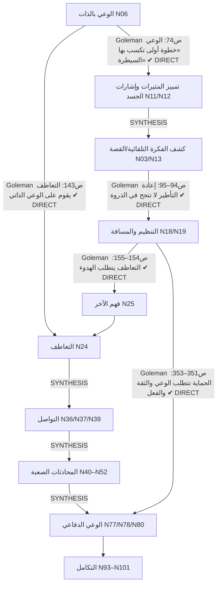

# 04_LEARNING_DEPENDENCIES — المتطلبات السابقة وتسلسل التعلم
**الوسم العام:** التسلسل المقترح هنا **[INTEGRATED_SYNTHESIS]**. المواضع التي يدعمها مصدر صراحةً مذكورة بصفحتها.

---

## 1. سلسلة المتطلبات الرئيسية


| الاعتماد | النوع | السند |
|---|---|---|
| الوعي بالذات ← التحكم | **DIRECT** | Goleman ص74 |
| التسمية ← حرية الاختيار (الوقفة) | **DIRECT** | Goleman ص74 |
| انخفاض الاستثارة ← إعادة التأطير | **DIRECT** | Goleman ص94–95 |
| الوعي بالذات ← التعاطف | **DIRECT** | Goleman ص143 |
| الهدوء ← التعاطف | **DIRECT** | Goleman ص154–155؛ + NVC L2199 «We need empathy to give empathy» (موازٍ) |
| الوعي + الحدود + الفعل ← الحماية | **DIRECT** | Goleman ص351–353 |
| الملاحظة ← STATE | **DIRECT** | CC p.124–126 |
| الحقيقة/التفسير ← فحص الدليل | **DIRECT** | MoM p.72–73 |
| التوكيد ← الحدود | **DIRECT** | MoM p.261–262 |
| التعاطف ← التواصل ← المحادثة الصعبة ← الدفاع | **SYNTHESIS** | ترتيب تعليمي؛ لا يفرضه مؤلف |

**الاستنتاج:** الترتيب الذي اقترحه الـBrief (Understand → Notice → Name+Reframe → Empathize → Communicate → Conflict → Protect → Integrate):
- **مدعوم في مفاصله الثلاثة الحرجة من Goleman نفسه**: الوعي قبل التعاطف، والهدوء قبل التعاطف، والتهدئة قبل إعادة التأطير.
- الباقي تعليمي.

---

## 2. السلسلة التي طلبها الـBrief (EMOTION → … → CONSEQUENCE) — مصححة وفق المصادر
**صيغة الـBrief:** EMOTION → INTERPRETATION → THOUGHT → BODY → BEHAVIOR → CONSEQUENCE.

**المشكلة:** وضع «الانفعال» قبل «التفسير» لا يطابق أي كتاب بشكل موحد (**D6**):
- MoM وCC يضعان التفسير/القصة قبل المزاج.
- Goleman يصف إنذارًا سريعًا قد يسبق التفكير.

**الصيغة المستخدمة في المشروع** — [INTEGRATED_SYNTHESIS] بطبقتين:
```
EVENT (المثير)
  ├─(طريق سريع — Goleman ص36–44)──► ALARM / BODY (إنذار جسدي فوري)
  └─(طريق أطول)──► INTERPRETATION / STORY (MoM p.16؛ CC p.98)
                          ↓
                    EMOTION (+ شدة 0–100)  ◄──┐  حلقة تغذية:
                          ↓                     │  المزاج يستدعي أفكارًا تشبهه
                    BODY ↔ THOUGHT ───────────┘  (MoM p.17؛ Goleman ص91–94)
                          ↓
                    IMPULSE → BEHAVIOR (Goleman ص20: «نزوع إلى الفعل»)
                          ↓
                    CONSEQUENCE → يصبح EVENT جديدًا (دوامة MoM p.8)
```
**في الحلقة:** تُعرض هذه السلسلة **كقصة لا كرسم**: الـ40 ثانية لنور، ثم كريم (S1، S2.2).

---

## 3. سلسلة الوعي ← الاختيار (AWARENESS → PAUSE → REFLECTION → REGULATION → CHOICE)
| الخطوة | العقدة | السند | النوع |
|---|---|---|---|
| AWARENESS | N06، N17 | Goleman ص73–74؛ KZ p.15 | DIRECT |
| PAUSE | N18 | KZ p.20–21؛ NVC L2836 | DIRECT |
| REFLECTION | N15، N35 | MoM p.71–75 | DIRECT |
| REGULATION | N19 | Goleman ص86–98؛ KZ p.63–64 | DIRECT |
| CHOICE | N18 → N19 | KZ p.145 «not… ruled by them»؛ Goleman ص74 «الحرية ليختار» | DIRECT |
| **السلسلة كوحدة واحدة** | — | — | **SYNTHESIS** (ربط 4 كتب) |

**تنبيه الـBrief محترم:** «المساحة بين المثير والاستجابة» تُقدَّم كمبدأ ممارسة من KZ (p.63–64)، **لا كادعاء علمي مطلق**. الصياغة الشائعة المنسوبة لـ«Viktor Frankl» **لا تُستخدم**، لأنها غير موجودة في المصادر وإسنادها محل خلاف [EXTERNAL KNOWLEDGE].

---

## 4. المعادلة (SELF-AWARENESS + EMPATHY + COMMUNICATION + CONFLICT MANAGEMENT = PRACTICAL EQ)
| المكون | العقد | السند الأقرب |
|---|---|---|
| SELF-AWARENESS | N06، N14 | Goleman ف4 — المجال 1 عند سالوفي (ص67) |
| EMPATHY | N24 | Goleman ف7 — المجال 4 |
| COMMUNICATION | N36، N39 | NVC؛ MoM ف15 — يقابله جزئيًا المجال 5 «توجيه العلاقات» |
| CONFLICT MANAGEMENT | N40–N55 | CC؛ Goleman ف9 |
| **= PRACTICAL EQ** | N104 | **[INTEGRATED_SYNTHESIS]**. نموذج سالوفي كما يعرضه Goleman (ص67–68) أقرب مصدر لكنه **خماسي** (يشمل «تحفيز النفس» و«إدارة العواطف») ⇒ المعادلة **تبسيط تعليمي** لا يُنسب لـGoleman |

---

## 5. هل يحترم ترتيب القصة (08) الاعتمادات؟
| الاعتماد | ترتيب القصة | متوافق؟ | ملاحظة |
|---|---|---|---|
| الوعي بالذات قبل التعاطف | Act 1–3 قبل Act 4 | ✔ | — |
| التهدئة قبل إعادة التأطير (في الذروة) | Act 2 (إعادة التأطير) **قبل** Act 3 (المسافة) | ✔ **بشرط** | Act 2 يعلّم إعادة التأطير **بأثر رجعي وبهدوء** (نور تراجع ما حدث)، ثم ينتهي بسؤال «وانت في النار؟» الذي يفتح Act 3 ⇒ القصة تحوّل الاعتماد نفسه إلى **حلقة مفتوحة**. هذا قرار سردي واعٍ لا خطأ |
| الهدوء قبل التعاطف | Act 3 قبل Act 4؛ S4.2 يقولها صراحة | ✔ | — |
| التعاطف قبل التواصل | Act 4 قبل Act 5 | ✔ | — |
| التواصل قبل الدفاع | Act 5 قبل Act 6–7 | ✔ | يجعل Dark EQ «انقلابًا» على مهارات مكتسبة |
| الدفاع يتطلب الوعي والحدود | Act 7 يعيد استخدام أدوات 1–5 | ✔ | — |

**النتيجة:** لا توجد مخالفة لأي اعتماد مصدري. الانحراف الوحيد عن الترتيب «المنطقي» (إعادة التأطير قبل المسافة) مقصود سرديًا ومبرر.

---

## 6. ما لا يعتمد عليه شيء (عقد طرفية)
عقد يمكن حذفها من الحلقة **دون كسر أي اعتماد** (مرشحة للمكتبة أو لـShorts):
- N23 التجنب
- N31 العدوى
- N34 قطار طوكيو (قيمته عاطفية لا بنيوية ⇒ **أُبقي لأنه ذروة عاطفية**)
- N46 التقدير
- N72 العقاب حسب المزاج
- N73 ألعاب الكلام
- N87 الإفصاح الآمن
- N89 سلطتك الداخلية
