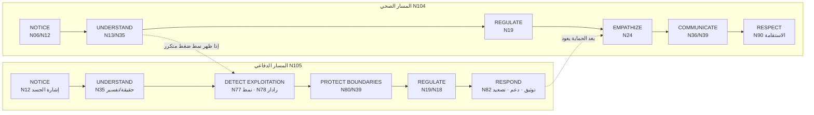
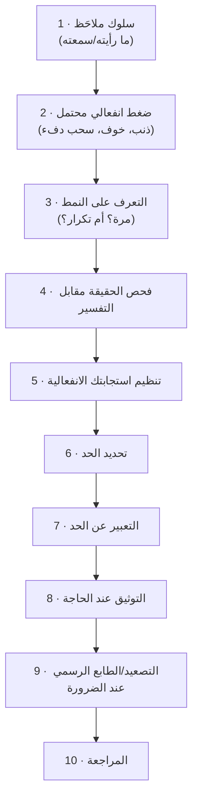

# 05_DARK_EQ_DEFENSIVE_GRAPH — الخريطة الدفاعية
**الوضع المصدري:** «Dark EQ» = **إطار تعليمي/دفاعي من تصميم المشروع** [INTEGRATED_SYNTHESIS].
- **لا يُنسب** المصطلح إلى Goleman ولا MoM ولا NVC ولا KZ ولا CC (العلاقة المرفوضة X001 في `02_CONCEPT_RELATIONSHIPS.csv`).
- ما يوجد في المصادر هو **مكونات منفصلة** تُربط هنا، ولا تُدمج في «بناء علمي» واحد.

**ممنوع في هذا الملف وفي الحلقة:** أي تسلسل من نوع «كيف تتلاعب». كل نمط يُعرض من زاوية **من يتعرض له**: ماذا يسمع، وكيف يتعرف، وكيف يرد.

---

## 1. المكونات منفصلة — لا بناء واحد
الـBrief يطلب تمييز هذه المكونات. كل مكون عقدة مستقلة، ولكل عقدة مصدرها ووظيفتها:

| المكون | العقدة | المصدر | صحي أم دفاعي؟ | ملاحظة |
|---|---|---|---|---|
| فهم الحالة الانفعالية للآخر | N24، N29 | Goleman ص143–146 | **صحي** (محايد في ذاته) | Goleman ص167: نفس القدرة «يمكن… استخدامها… للإضرار» |
| التعرف على الاحتياجات | N26 | NVC L1215–1409 | **صحي** | معرفة احتياج شخص = معلومة (زرع 3 في القصة) |
| التعرف على الخوف/التهديد | N01، N22 | Goleman ف2؛ MoM ف14 | **مشترك** | القلق قد يكون إنذارًا حقيقيًا (MoM p.223–224) |
| ضبط النفس الانفعالي | N19 | Goleman ف5 | **مشترك** | أساس الصحي والدفاعي معًا |
| التعاطف | N24 | Goleman ف7؛ NVC ف7–8 | **صحي** | يتطلب الهدوء؛ غيابه + التبرير = N74 |
| التفسير المعرفي | N13، N15 | MoM؛ CC ف6 | **مشترك** | الشعور بالاستغلال تفسير يحتاج دليلًا (N78) |
| التلاعب (كوصف لسلوك) | N62–N73 | Goleman، NVC، CC، KZ، MoM (انظر §3) | **دفاعي: يُتعرَّف عليه** | لا يوجد تعريف موحد للتلاعب في المصادر؛ CC يعدّه نوعًا من «العنف» (p.24) |
| الضغط | N65، N66، N63 | NVC؛ CC؛ Goleman | **دفاعي** | مجموعة، لا عقدة واحدة |
| الحدود | N80 | NVC ف5، ف12؛ MoM ف15؛ KZ؛ CC | **صحي + دفاعي** | «الحدود ليست عدوانًا» |
| الوعي الدفاعي | N77، N78 | CC p.205؛ MoM p.155، 158، 230 | **دفاعي** | «لا سذاجة ولا بارانويا» |

---

## 2. المساران — [INTEGRATED_SYNTHESIS] (ليس نموذجًا لأي مؤلف)

- **لماذا تأتي REGULATE بعد PROTECT في المسار الدفاعي؟**
  - الترتيب من الـBrief.
  - مبرره المصدري: في الضغط، تحديد الحد يسبق «التهدئة للتعاطف». MoM p.256: من يشعر بالعجز قد يحتاج **أن يشعر بغضبه** لا أن يضبطه.
  - مع ذلك تبقى الوقفة (N18) متاحة في كل خطوة (R: N18 APPLIES_TO N105).
- **المسار الدفاعي فرع من الصحي لا بديل عنه** (N105 COMPLEMENTS N104). الحماية مبنية على **نفس** المهارات: الوعي، والحقائق، والتوكيد، والتنظيم.

---

## 3. المرآة: كل مهارة صحية ← سوء استخدامها ← كيف تتعرف ← كيف تحمي نفسك
*عمود «سوء الاستخدام» وصفي من المصادر، وليس تعليمات.*

| المهارة الصحية | سوء استخدامها كما تصفه المصادر | كيف يظهر لمن يتعرض له | كيف تتعرف (الدليل) | كيف تحمي نفسك | السند |
|---|---|---|---|---|---|
| قراءة الانفعالات (N24، N29) | «لإغاظة أخ أو الإضرار به» (Goleman ص167)؛ وجهة نظر قديمة «أكثر تشاؤمًا» ترى الذكاء الاجتماعي «قدرة على خداع الآخرين» (ص65–66) | شخص «يعرف بالضبط» ما يوجعك | نمط: تتكرر الإشارة إلى نقاط ضعفك في لحظات الطلب | لا تشارك نقاط ضعف بلا داعٍ (N87)؛ لاحظ التوقيت (N77) | Goleman |
| التعبير الانفعالي (N02) | «الأمزجة المخادعة»: محصلون «يتعمدون إظهار الغضب» (ص89)؛ التعبير المبالغ فيه كخدعة (ص168) | غضب أو دموع تظهر مع كل «لأ» وتختفي مع «نعم» | الانفعال يرتبط بالنتيجة لا بالحدث (N62 + N77) | الفهم ≠ الامتثال (N30)؛ لا تدخل لعبة الانفعال (N88) | Goleman؛ KZ p.168 |
| معرفة الاحتياجات/المسؤولية (N26، N57) | «To motivate by guilt, mix up stimulus and cause» (NVC L2744) | «لو كنت بتحبني/بتحترمني كنت…» | اختبار NVC: ماذا يحدث بعد «لأ»؟ لوم أو ذنب ⇒ مطالبة (L1761–1797) | «Acknowledge any truth… and at the same time stand up for your own rights» (MoM p.262)؛ سجل الذنب (S7.2) | NVC؛ MoM |
| الدفء والاهتمام (N24) | «the withdrawal of caring or respect is one of the most powerful threats of all» (NVC L3400)؛ «I pout… hoping it'll make you feel bad» (CC p.88–90) | الدفء يُسحب مع «لأ» ويعود مع «نعم» | الانسحاب **مشروط** ومتكرر، ويختلف عن انسحاب الطوفان (N48) | القوة الحامية لا العقابية (N81)؛ الحديث عن النمط (N77) | NVC؛ CC؛ Goleman ص196–197 |
| التقدير (N46) | مديح «يعمل» لرفع الإنتاجية فيُكتشف كتلاعب (NVC L3670–3680) | مديح عام مكثف يسبق طلبًا | عام لا محدد؛ مقترن بطلب | فرّق بين المديح والتقدير (فعل + احتياج + شعور) | NVC |
| الهدوء/ضبط النفس (N19) | عنف «محسوب» مع انخفاض النبض «للسيطرة… بغرس الخوف» (Goleman ص160–161) | تهديد هادئ جدًا | الهدوء المصاحب للتهديد **علامة لا طمأنة** | [SAFETY] توثيق + دعم + جهة رسمية (N79، N82) | Goleman؛ CC p.194–195 |
| السلطة/القيادة | الرئيس «المستبد» الذي يُسكت فريقه (Goleman ص213)؛ «We borrow power from the boss» (CC p.24) | لا أحد يعترض | صمت جماعي؛ «ghosts of previous leaders» (CC p.198–200) | اشتغل على نفسك أولًا، واستشر زميلًا، وSTATE (CC)؛ سلطتك الداخلية (KZ p.124–125) | Goleman؛ CC؛ KZ |
| التكيف الاجتماعي | «المتلونون اجتماعيًا» — «يقولوا شيئًا ويفعلوا شيئًا آخر» (Goleman ص175–177) | انطباع ممتاز بلا ثبات | الفجوة بين القول والفعل عبر الزمن | «الأفعال قبل الكلمات» (الدرع 1)؛ النموذج الصحي: «الأمانة والتكامل» | Goleman |
| العطاء | «Mindless giving… a way of making sure others… feel dependent on you» (KZ p.54–55) | «أنا اللي وقفت جنبك» كرصيد يُصرف | الاعتماد يُصنع ثم يُستخدم | «trust your intuition about exploitation» (KZ p.55)؛ كارلا: توقّع المقاومة عند التغيير (MoM p.172–173) | KZ؛ MoM |
| اللغة الأخلاقية/الدينية | «people who hide behind the cloak of spirituality… to harm others» (KZ p.172)؛ لغة «الواجب/الأوامر» تنفي المسؤولية (NVC L666–742) | رمز مقدس أو «الأصول» تُستخدم لإنهاء النقاش | هل الرمز هنا يحمي أم يُسكت؟ | رأي خارجي موثوق (الدرع 6)؛ النقد موجه للتوظيف لا للدين | KZ؛ NVC |
| الأدوات الحوارية نفسها (N36، N42) | NVC: «not an appropriate tool» إن كان الهدف «to get our way» (L1801)؛ CC: «Mutual Purpose is not a technique» (p.69–70) | «حوار» هادئ حتى تستسلم (CC p.83 «false dialogue») | الهدف هو الاستسلام لا الفهم | اختبار السؤالين (N81) | NVC؛ CC |

---

## 4. التسلسل الدفاعي الكامل (المطلوب في Phase 3) — مع المفهوم المصدري لكل عقدة

| # | الخطوة | العقدة | المفهوم المصدري الأساسي | الصفحة | نوع الربط | خطأ شائع تمنعه الخطوة |
|---|---|---|---|---|---|---|
| 1 | سلوك ملاحَظ | N35 | الملاحظة بلا تقييم؛ «can you see or hear it?» | NVC L766–873؛ CC p.105 | DIRECT | البدء بالحكم |
| 2 | ضغط انفعالي محتمل | N65، N66، N63 | الذنب يخلط المثير بالسبب؛ سحب الاهتمام تهديد؛ التخويف المحسوب | NVC L2744، L3400؛ Goleman ص160 | DIRECT (المفاهيم) / SYNTHESIS (التسمية «ضغط») | إنكار الإحساس أو تضخيمه |
| 3 | التعرف على النمط | N77 | «talk about the pattern… not the latest instance» | CC p.205–206 | DIRECT (السياق: المحاسبة) / SYNTHESIS (التطبيق) | اتهام من موقف واحد |
| 4 | الحقيقة مقابل التفسير | N78، N35 | «manipulated» ليست شعورًا؛ «I've been taken advantage of» = فكرة؛ فرط اليقظة يُعاير | NVC L1047–1063؛ MoM p.47–49، 155، 230؛ KZ p.158 | DIRECT | البارانويا **و**السذاجة |
| 5 | تنظيم استجابتك | N18، N19، N53 | الوقفة؛ الوقت المستقطع؛ لا تقرر في الذروة | KZ p.20–21؛ MoM p.261؛ Goleman ص48–49 | DIRECT | القرار تحت الخوف/الذنب |
| 6 | تحديد الحد | N80، N84 | الحدود ليست عدوانًا؛ الغضب الصحي إشارة | NVC L1441–1483؛ MoM p.256 | DIRECT | الخلط بين الحد والعقاب |
| 7 | التعبير عن الحد | N39، N95* | التوكيد: «acknowledge… and stand up»؛ عبارة الحد الهادئة | MoM p.261–262؛ CC p.208–209 | DIRECT | الهجوم أو الخضوع |
| 8 | التوثيق | N79 | «One dull pencil is worth six sharp minds» | CC p.177 | DIRECT (السياق: القرارات) / SYNTHESIS (التطبيق) | «كلمتي ضد كلمته» |
| 9 | التصعيد | N82 | HR «to ensure your rights and dignity»؛ إيرين (دعم + شرطة)؛ برامج مساعدة؛ المسافة مشروعة | CC p.194–195؛ Goleman ص291–293؛ MoM p.201، 263 | DIRECT | العزلة والصمت |
| 10 | المراجعة | N85، N101 | فطيرة المسؤولية («draw your own slice last»)؛ ليس كل ذنب زائفًا | MoM p.272–274 | DIRECT | لوم الذات أو إعفاء المخطئ |

*\*N95 هنا = قالب عبارة الحد (KB-095)، لا عقدة PAUSE في الإطار.*

### 4.1 علامات الأمان في التسلسل [SAFETY]
- إن وُجد **تهديد جسدي أو جنسي أو قانوني**، تنتقل مباشرة من الخطوة 2 إلى الخطوة 9. لا حاجة لإثبات «النمط» أولًا.
  - MoM p.201: «almost all communities have special programs nearby to help you».
  - MoM p.24: «The goal is to stop the abuse».
- أدوات إعادة التأطير (الخطوة 4) **لا تُستخدم لإقناع النفس بتحمل الإساءة** (MoM p.24).

---

## 5. تطبيق التسلسل على مثال الـBrief (تعليمي)
| الخطوة | «لو كنت بتحترمني كنت وافقت» |
|---|---|
| 1 سلوك | طلب ← رفضتُ ← جملة تربط الرفض بعدم الاحترام |
| 2 ضغط محتمل | ذنب (NVC L1209) |
| 3 نمط؟ | هل تتكرر الجملة مع كل «لأ»؟ (CC p.205) |
| 4 حقيقة/تفسير | الحقيقة: رفضتُ طلبًا. التفسير الذي يُعرض عليّ: «أنا لا أحترمه». فكرتي التلقائية: «أنا شخص سيئ» (MoM) |
| 5 تنظيم | اسم الشعور: ذنب 70. نفَس. لا رد فوري |
| 6 حد | «الرفض ليس قلة احترام» |
| 7 التعبير | «لما يتم ربط الطلب بإحساسي بالذنب، أنا مش مرتاح للطريقة دي. أنا مستعد أتكلم عن المشكلة نفسها، لكن مش هقدر أوافق تحت ضغط.» (صياغة الـBrief) + «أنا فاهم إنك متضايق، وفي نفس الوقت…» (MoM p.262) |
| 8 توثيق | فقط إذا كان السياق عملًا أو اتفاقًا |
| 9 تصعيد | فقط إذا تحوّل إلى تهديد أو ضرر |
| 10 مراجعة | «هل كان عندي جزء من المسؤولية؟ ما حجمه؟» |

---

## 6. ONE INCIDENT مقابل REPEATED PATTERN — قاعدة تشغيل
| المعيار | واقعة (هشام) | نمط (عادل) |
|---|---|---|
| التكرار | مرة واحدة | متكرر بنفس الشكل |
| الارتباط بطلب/مصلحة | لا | نعم — يسبق طلبًا أو يلي «لأ» |
| الاستجابة للمعلومة/الحوار | يتغير عند التوضيح (Goleman ص216–217) | لا يتغير؛ «ألعاب الكلام» (CC p.211) |
| رد الفعل على «لأ» | — | لوم/ذنب/سحب دفء (NVC L1761) |
| الحديث المناسب | عن **المحتوى** | عن **النمط** ثم **العلاقة** (CC p.205–206) |
| اللغة | «الموقف ده كان صعب» | «ده سلوك تلاعبي» — لا «ده شخص نرجسي» (NVC L3564؛ Goleman ص161) |

---

## 7. ضمانات عدم التحول إلى «دليل تلاعب» — فحص
| الضمانة | الحالة |
|---|---|
| لا عقدة من نوع «طريقة» أو «تقنية تلاعب» | ✔ الأنماط كلها PATTERN (للتعرف) |
| كل نمط مقرون بمهارة حماية (PROTECTS_AGAINST / CONTRASTS_WITH) | ✔ 12/13 نمطًا لها حافة حماية أو تقابل مباشرة (PROTECTS_AGAINST / CONTRASTS_WITH). الاستثناء: N72 (العقاب حسب المزاج) — عقدة مكتبة لا تظهر في الحلقة |
| لا تشخيص | ✔ N86 + علاقة مرفوضة X002 |
| المصطلح لا يُنسب لمؤلف | ✔ X001 |
| «Love bombing» لا يُقدَّم كمصطلح مصدري | ✔ X003 |
| الإحساس بالتلاعب ليس دليلًا عليه | ✔ X012 + N78 |
