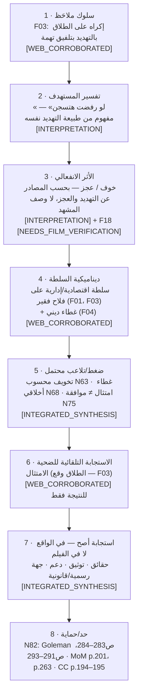

# 06_ATTAMAN_CASE_GRAPH — خريطة حالة «العمدة عتمان»
**الوضع:** [FICTIONAL_CASE_STUDY] — شخصية درامية في فيلم «الزوجة الثانية» (1967، إخراج صلاح أبو سيف).
- **ليست تشخيصًا لأي شخص حقيقي**.
- لا نستنتج اضطرابات.
- لا نقدم حوارًا غير متحقق منه كاقتباس.
- لا نستخدم الأسماء أو الحقائق المتنازع عليها.

**مستويات اليقين المستخدمة:**
| الوسم | المعنى | يُستخدم في الحلقة؟ |
|---|---|---|
| [WEB_CORROBORATED] | اتفق عليه مصدرا ويب مستقلان أو أكثر (`00_SOURCE_AUDIT/notes/FILM_notes.md`) — لم يُتحقق منه بالمشاهدة بعد | **نعم، كوصف سلوك عام**، دون حوار ودون تفاصيل مشهد |
| [NEEDS_FILM_VERIFICATION] | مصدر واحد، أو صياغة صحفية، أو تعارض، أو غياب مصدر | **لا**، حتى المشاهدة |
| [INTERPRETATION] | قراءة تعليمية من المشروع | نعم، **بوسم صريح** ودون نسبتها للفيلم أو صناعه |

---

## 1. سجل الملاحظات
| ID | الملاحظة | الحالة | المصادر | المرجع |
|---|---|---|---|---|
| F01 | عمدة ثري متسلط؛ زوجته الأولى (حفيظة) لم تنجب له ولدًا | [WEB_CORROBORATED] | ويكيبيديا؛ السينما.كوم؛ فيتو | FILM §3.1 |
| F02 | الحافز المعلن في الفيلم: الرغبة في وريث | [WEB_CORROBORATED] | ويكيبيديا؛ السينما.كوم؛ فيتو | FILM §3.1، §6 |
| F03 | يُجبر أبو العلا على تطليق فاطمة تحت التهديد بتلفيق تهمة/السجن | [WEB_CORROBORATED] | ويكيبيديا + نتائج متعددة | FILM §3.4 |
| F04 | شيخ القرية يمنح قرارات العمدة غطاءً دينيًا | [WEB_CORROBORATED] | ويكيبيديا (عبر البحث)؛ الجزيرة (رأي) | FILM §3.5–3.6 |
| F05 | فاطمة تقاوم وتستخدم الحيلة لتبعده عنها | [WEB_CORROBORATED] | ويكيبيديا؛ السينما.كوم | FILM §3.7 |
| F06 | النهاية: شلل/سكتة ثم وفاة؛ إتلاف الأوراق المزورة وإعادة الأراضي | [WEB_CORROBORATED] | ويكيبيديا؛ السينما.كوم؛ فيتو | FILM §3.8 |
| F07 | تفصيل الاستيلاء على الأراضي باستغلال الأميين | [NEEDS_FILM_VERIFICATION] | السينما.كوم فقط | FILM §3.2 |
| F08 | الشيخ يعترض أولًا (العدة) ثم يمتثل | [NEEDS_FILM_VERIFICATION] | فيتو فقط | FILM §3.5 |
| F09 | الصياغة الحرفية «البلد بلدنا والدفاتر دفاترنا…» وسياقها | [NEEDS_FILM_VERIFICATION] | فيتو (صياغة صحفية) | FILM §4 |
| F10 | تلاوة الآية في مشهد العقد (السياق الدقيق) | [NEEDS_FILM_VERIFICATION] | ثلاث مقالات صحفية | FILM §4 |
| F11 | خوف أهل القرية وصمتهم في مشاهد محددة | [NEEDS_FILM_VERIFICATION] | قراءة وصفية | FILM §6–7 |
| F12 | اسم الشيخ (حسن؟ مبروك؟) | [NEEDS_FILM_VERIFICATION] | تعارض | FILM §2 |
| F13 | «فتوى» داخل الفيلم ببطلان الطلاق المكره | [NEEDS_FILM_VERIFICATION] | الجزيرة (رأي) | FILM §3.6 |
| F14 | جملة العطار «دي بت ولادة…» | [NEEDS_FILM_VERIFICATION] | الدهليز فقط | FILM §4 |
| F15 | جمل متداولة («الليلة يا عمدة»، «خسارة فيا»…) | [NEEDS_FILM_VERIFICATION] | صحفي، والقائل غير محدد | FILM §4 |
| F16 | تفاصيل دور حفيظة وضغط الإنجاب عليها | [NEEDS_FILM_VERIFICATION] | — | FILM §7 |
| F17 | «الأبوة الزائفة» كخطاب للعمدة | [NEEDS_FILM_VERIFICATION] / غير مدعوم | لا مصدر | KB-131 |
| F18 | ردود فعل أبو العلا وفاطمة الانفعالية كما تُعرض | [NEEDS_FILM_VERIFICATION] | لا وصف مفصل | — |

**الإجمالي:** 18 ملاحظة. **6** [WEB_CORROBORATED]. **12** [NEEDS_FILM_VERIFICATION].

---

## 2. خريطة الحالة (المطلوبة): السلوك ← … ← الحماية
*مبنية على **F03** (الملاحظة الأقوى والمؤكدة). كل عقدة تحمل مستوى يقينها.*

| # | العقدة | المحتوى | السند المفاهيمي | اليقين |
|---|---|---|---|---|
| 1 | السلوك الملاحَظ | تهديد بتلفيق تهمة لفرض طلاق | FILM F03 | [WEB_CORROBORATED] |
| 2 | تفسير المستهدف | «الرفض = سجن» | طبيعة التهديد كما تصفه المصادر؛ MoM p.229 (القلق = الخطر > القدرة) | [INTERPRETATION] |
| 3 | الأثر الانفعالي | خوف، عجز | Goleman ص283–284 (العجز وعدم السيطرة)؛ MoM p.256 | [INTERPRETATION] — **لا نصف** ما تظهره المشاهد (F18) |
| 4 | ديناميكية السلطة | سلطة + غطاء ديني | Goleman ص213–214؛ CC p.24 «We borrow power from the boss»؛ KZ p.172 | F01، F03، F04 [WEB_CORROBORATED] |
| 5 | الضغط المحتمل | تخويف محسوب؛ غطاء؛ امتثال لا موافقة | Goleman ص160–161؛ KZ p.172؛ CC p.23؛ NVC L640–642 | [INTEGRATED_SYNTHESIS] |
| 6 | الاستجابة التلقائية | الامتثال | CC p.23 (Butler)؛ MoM p.256 (الاستسلام بدل الغضب) | النتيجة [WEB_CORROBORATED] |
| 7 | الاستجابة الأصح | **في الحياة الواقعية**: حقائق، توثيق، دعم، جهة رسمية | CC p.177، 194–195؛ Goleman ص291–293، 351–353؛ MoM p.201 | [INTEGRATED_SYNTHESIS] — **لا نزعم** أن شخصيات الفيلم كان بإمكانها ذلك في سياقها الدرامي (قرية الستينيات، سلطة شبه مطلقة) |
| 8 | الحماية | شبكة دعم + جهة رسمية + عدم لوم الذات | Goleman ص353؛ MoM p.263، 272–274 | DIRECT (المبدأ) |

**تحذير سردي:**
- **حيلة فاطمة (F05)** حل درامي في سياق عجز كامل.
- تُذكر كـ«استعادة قدر من السيطرة» بلغة Goleman ص283–284 (N82).
- **لا تُقدَّم كنموذج يُحتذى في الواقع**.

---

## 3. روابط الفيلم ← المفاهيم (من `02_CONCEPT_RELATIONSHIPS.csv`، طبقة CASE)
| الربط | الملاحظة | المفهوم | الحالة | الاستخدام في القصة |
|---|---|---|---|---|
| C001 | F03 | N63 التخويف المحسوب | [WEB_CORROBORATED] | S4.7، S6.3 |
| C002 | F03 | N75 الامتثال ≠ الموافقة | [WEB_CORROBORATED] | S6.3 «وافق ولا امتثل؟» |
| C003 | F03 | N64 السلطة المرهبة | [WEB_CORROBORATED] | S6.3 |
| C004 | F04 | N68 الغطاء الأخلاقي/الديني | [WEB_CORROBORATED] | S6.3 (كوصف عام، بلا حوار) |
| C005 | F02 | N92 (الحاجة المعلنة: وريث) | [WEB_CORROBORATED] | S6.3 (عنصر «الحاجة») |
| C006 | F05 | N82 استعادة السيطرة | [WEB_CORROBORATED] + تحذير | S7.6 |
| C007 | F06 | N79 من يملك الورق يملك الرواية | [WEB_CORROBORATED] + [INTERPRETATION] | اختياري في S8.5 |
| C008 | F07 | N70 الاعتمادية | [NEEDS_FILM_VERIFICATION] | محجوز |
| C009 | F08 | N74 إسكات الضمير | [NEEDS_FILM_VERIFICATION] | محجوز |
| C010 | F09 | N64 الاستيلاء على الإجراء الرسمي | [NEEDS_FILM_VERIFICATION] | محجوز |
| C011 | F10 | N68 الاقتباس المقدس لإنهاء النقاش | [NEEDS_FILM_VERIFICATION] | محجوز (نستخدم F04 العام بدلًا منه) |
| C012 | F11 | N71 صمت الشهود | [NEEDS_FILM_VERIFICATION] | S6.4 بصيغة شرطية فقط؛ القصة الأساسية هناك هي قصة الطيار (مصدر مباشر) |
| C013 | F11 | N76 العجز | [NEEDS_FILM_VERIFICATION] | كالسابق |

---

## 4. عناصر تحليل الـBrief الثمانية — ماذا يُسمح به الآن؟
| العنصر | المسموح الآن | المحجوز حتى المشاهدة |
|---|---|---|
| POWER | سلطة العمدة الاقتصادية/الإدارية (F01، F03) | تفاصيل «الدفاتر» (F09) |
| FEAR | التهديد بالسجن كأداة (F03) | خوف القرية في مشاهد (F11) |
| STATUS | مكانة العمدة | مشاهد التفاخر |
| GUILT | — (لا توجد ملاحظة مؤكدة عن استخدام الذنب) | — ⇒ **لا يُنسب للشخصية**؛ يُدرَّس عبر عادل والجدار (S6.5–S6.6) |
| DEPENDENCY | — | F07 |
| SOCIAL PRESSURE | الغطاء الديني كسلوك عام (F04) | الصمت الجماعي (F11) |
| AUTHORITY | الشيخ كأداة شرعنة (F04) | الاعتراض ثم الامتثال (F08)؛ الاسم (F12) |
| EMOTIONAL NEEDS | **فقط** الحافز المعلن: الوريث (F02) | أي دافع نفسي آخر ⇒ **مرفوض** (X010) |
| «الأبوة الزائفة» | — | F17 (غير مدعوم حاليًا — X011) |

---

## 5. قائمة المشاهدة المطلوبة قبل PHASE 6 (Script)
1. مشهد الإكراه على الطلاق: الصياغة الفعلية للتهديد؛ ردود فعل أبو العلا (F03، F18).
2. مشهد عقد الزواج: اعتراض الشيخ أو عدمه؛ الجملة الحرفية؛ الآية وسياقها؛ اسم الشيخ (F08، F09، F10، F12).
3. مشاهد القرية أمام العمدة: هل يظهر الخوف/الصمت فعلًا؟ (F11).
4. مشهد «الفتوى» المشار إليه في مقال الجزيرة (F13).
5. مشاهد حفيظة (F16)؛ العطار (F14)؛ الجمل المتداولة (F15).
6. أي خطاب «أبوي» للعمدة تجاه الفلاحين (F17).
7. **حقوق الاستخدام**: لا لقطات من الفيلم في الفيديو دون ترخيص [EXTERNAL KNOWLEDGE]. الحل الحالي: رسوم تعبيرية ووصف منطوق، والشخصية المرسومة لا تشبه الممثل.
