# 01_MASTER_KNOWLEDGE_GRAPH — الخريطة الرئيسية للمعرفة
**PHASE 3 — KNOWLEDGE GRAPH** · يُبنى فوق `01_KNOWLEDGE_BASE` (142 مدخلًا) **دون تعديله**.
**الملفات المرافقة:** `02_CONCEPT_RELATIONSHIPS.csv` (العلاقات) · `02b_GRAPH_NODES.csv` (العقد) · `03_BOOK_CROSSWALK.md` · `04_LEARNING_DEPENDENCIES.md` · `05_DARK_EQ_DEFENSIVE_GRAPH.md` · `06_ATTAMAN_CASE_GRAPH.md` · `07_GRAPH_QA_REPORT.md` · `08_STORY_ARCHITECTURE.md` · `09_RETENTION_ARCHITECTURE.md`

---

## 0. لماذا خريطتان؟
بحسب التوجيه الرئيسي الجديد، **المعلومة وقود وليست المنتج**. لذلك تُبنى في هذه المرحلة خريطتان متوازيتان:

| | **GRAPH A — خريطة المعرفة** (هذا الملف + 02–07) | **GRAPH B — خريطة القصة** (08 + 09) |
|---|---|---|
| السؤال | كيف ترتبط المفاهيم علميًا وتعليميًا؟ | متى وكيف **يكتشف المشاهد** المفهوم؟ |
| الوحدة | عقدة مفهوم (N##) + علاقة (R###) | مشهد (S#.#) داخل فصل درامي (ACT) |
| معيار النجاح | كل علاقة لها دليل ومصدر وتصنيف | «هل سيكمل المشاهد الفرجة؟» |
| الرابط بينهما | عمود **STORY_SCENE** في `02b_GRAPH_NODES.csv` — كل عقدة لها موقع معرفي وموقع قصصي | عمود **CONCEPT DISCOVERED** في 08 يحيل إلى N## |

> **القاعدة:** لا توجد عقدة في خريطة المعرفة تُعرض في الحلقة لأنها «مهمة» فقط؛ تُعرض إذا خدمت مشهدًا. والمعلومة التي لا مشهد لها تبقى في المكتبة.

---

## 1. مفتاح القراءة

### 1.1 أنواع العقد (يجيب عن السؤال 7: مهارة عملية أم نموذج تفسيري؟)
| النوع | المعنى | العدد |
|---|---|---|
| MODEL | نموذج تفسيري (يشرح لماذا/كيف) | {{T_MODEL}} |
| SKILL | مهارة عملية يمكن التدرب عليها | {{T_SKILL}} |
| DEF_SKILL | مهارة دفاعية (كشف/حماية) | {{T_DEF_SKILL}} |
| PATTERN | نمط سلوكي يُتعرَّف عليه (لا يُعلَّم كطريقة) | {{T_PATTERN}} |
| FRAME | إطار من تصميم المشروع/الـBrief | {{T_FRAME}} |
| CASE | حالة درامية خيالية | {{T_CASE}} |

### 1.2 مجالات العقد (يجيب عن السؤالين 8 و9)
| المجال | المعنى | العدد |
|---|---|---|
| HEALTHY | ذكاء عاطفي صحي (فهم، تعاطف، تواصل، احترام) | {{D_HEALTHY}} |
| DEFENSIVE | وعي دفاعي (كشف، حماية، حدود) | {{D_DEFENSIVE}} |
| SHARED | أساس يخدم المسارين (وعي، تسمية، وقفة، حقائق) | {{D_SHARED}} |
| FRAMEWORK | خطوات النظام النهائي وخطة الأيام السبعة | {{D_FRAMEWORK}} |

### 1.3 وسوم العقد (يجيب عن السؤال 10: ما هو تركيب المشروع؟)
| الوسم | المعنى | العدد |
|---|---|---|
| DIRECT_SOURCE | المفهوم من كتاب واحد بالصفحة | {{G_DIRECT_SOURCE}} |
| CROSS_BOOK | المفهوم موجود مستقلًا في أكثر من كتاب (دُمج في عقدة واحدة، والمراجع محفوظة) | {{G_CROSS_BOOK}} |
| INTEGRATED_SYNTHESIS | عقدة من تصميم المشروع (مثل «Dark EQ» والمساران) | {{G_INTEGRATED_SYNTHESIS}} |
| USER_FRAMEWORK | من إطار الـBrief (الخطوات التسع، الدرع، خطة 7 أيام) | {{G_USER_FRAMEWORK}} |
| FICTIONAL_CASE_STUDY | شخصية درامية (عتمان) | {{G_FICTIONAL_CASE_STUDY}} |

### 1.4 تصنيف العلاقات
| التصنيف | المعنى | العدد |
|---|---|---|
| [DIRECT_SOURCE_RELATIONSHIP] | العلاقة نفسها مذكورة في مصدر (مع الاقتباس أو الصفحة في عمود EVIDENCE) | {{C_D}} |
| [CROSS_BOOK_PARALLEL] | مفهومان متشابهان أو متكاملان في كتابين **دون** أن يقتبس أحدهما الآخر | {{C_P}} |
| [CROSS_BOOK_DIFFERENCE] | الكتب تؤطر الآلية بشكل مختلف (D1–D7 + فرق صغير) | {{C_X}} |
| [INTEGRATED_SYNTHESIS] | ربط تعليمي من المشروع — **لا يُنسب لمؤلف** | {{C_S}} |
| [EXTERNAL_KNOWLEDGE] | لم يُحتج إليه كعلاقة؛ استُخدم مرة واحدة كتحفظ داخل علاقة مرفوضة (X007) | 0 |
| [UNSUPPORTED] | علاقات مقترحة **رُفضت** ومسجلة لبيان السبب | {{C_U}} |
| حالة الفيلم (CASE) | ربط ملاحظة من الفيلم بمفهوم — تركيب المشروع + حالة التحقق | {{C_CASE}} |

**أسماء العلاقات المستخدمة:** CAUSES · LEADS_TO · ENABLES · REQUIRES · REINFORCES · EXPLAINS · CONTRASTS_WITH · COMPLEMENTS · APPLIES_TO · PROTECTS_AGAINST · REINTERPRETS · PRACTICES · TRANSITIONS_TO · SYNTHESIZES.

> **قاعدة الإنشاء:** لم تُنشأ علاقة لأن مفهومين «يتشابهان». روابط «Related Concepts» في قاعدة المعرفة (336 رابطًا غير مصنّف) هي روابط تصفح داخلية ولم تُحسب هنا كعلاقات؛ كل علاقة في هذا الملف كُتبت يدويًا بدليل وتصنيف.

---

## 2. الهرم ذو المستويات السبعة (العمود الفقري: Goleman)

{{LEVEL_SUMMARY}}

### 2.1 خريطة الهيكل — العلاقات المحورية فقط
*(الخريطة الكاملة = الجدول في `02_CONCEPT_RELATIONSHIPS.csv`. هنا ~40 علاقة تحمل منطق الحلقة. الخط المتصل = مصدر مباشر؛ المتقطع = موازاة بين كتب؛ المنقط بعلامة ✕ = اختلاف حقيقي؛ الرمادي = تركيب المشروع.)*

```mermaid
flowchart TB
  subgraph L1["المستوى 1 — الأساس (Goleman ق1)"]
    N01[جرس الإنذار<br/>الأميجدالا]; N02[الانفعال<br/>نزوع للفعل]; N07[القشرة الأمامية<br/>مفتاح الإيقاف]; N09[الذاكرة الانفعالية]; N06[الوعي بالذات]; N03[الفكرة التلقائية]
  end
  subgraph L2["المستوى 2 — التنظيم الداخلي"]
    N11[المثيرات]; N12[إشارات الجسد]; N13[التفسير/القصة]; N14[تسمية الشعور]; N15[الفكرة الساخنة والدليل]; N16[الفكرة المتوازنة]; N17[اليقظة]; N18[الوقفة]; N19[التنظيم]
  end
  subgraph L3["المستوى 3 — فهم الآخر"]
    N24[التعاطف]; N25[المنظور والفضول]; N26[الاحتياجات]; N28[الإنصات]; N30[الفهم ≠ الموافقة]
  end
  subgraph L4["المستوى 4 — التواصل"]
    N35[الملاحظة ≠ التفسير]; N36[NVC]; N37[الطلب ≠ المطالبة]; N39[التوكيد]; N42[الهدف المشترك]; N44[STATE]
  end
  subgraph L5["المستوى 5 — الضغط العالي"]
    N47[النوبة الانفعالية]; N48[الطوفان]; N51[الصمت والعنف]; N52[ابدأ بالقلب / و]; N53[الوقت المستقطع]
  end
  subgraph L6["المستوى 6 — الوعي الدفاعي (تركيب المشروع فوق مصادر)"]
    N61[ازدواجية الاستخدام<br/>Gol ص65،167]; N65[الذنب كأداة]; N64[السلطة المرهبة]; N77[النمط ≠ الواقعة]; N78[معايرة الرادار]; N80[الحدود]; N82[الحماية والدعم]; N83[حدود إعادة التأطير]
  end
  subgraph L7["المستوى 7 — التكامل (إطار الـBrief)"]
    N93[NOTICE] --> N94[NAME] --> N95[PAUSE] --> N96[UNDERSTAND] --> N97[REGULATE] --> N98[EMPATHIZE] --> N99[COMMUNICATE] --> N100[NAVIGATE] --> N101[REFLECT]
  end
  N01 -->|CAUSES| N47
  N09 -->|EXPLAINS| N11
  N11 -->|LEADS_TO| N47
  N07 -->|ENABLES| N19
  N06 -->|ENABLES| N24
  N19 -->|ENABLES| N24
  N14 -->|ENABLES| N18
  N13 -->|LEADS_TO| N02
  N03 -->|EXPLAINS| N02
  N35 -->|ENABLES| N15
  N16 -->|PRACTICES| N15
  N16 -->|REQUIRES| N19
  N17 -->|ENABLES| N18
  N18 -->|LEADS_TO| N19
  N12 -.->|PARALLEL| N06
  N18 -.->|PARALLEL| N53
  N30 -.->|PARALLEL| N24
  N37 -->|PRACTICES| N36
  N35 -->|ENABLES| N44
  N52 -->|PROTECTS_AGAINST| N51
  N53 -->|PROTECTS_AGAINST| N48
  N39 -.->|PARALLEL| N52
  N61 -->|REINTERPRETS| N24
  N37 -->|PROTECTS_AGAINST| N65
  N39 -->|PROTECTS_AGAINST| N65
  N64 -.->|PARALLEL| N51
  N15 -->|ENABLES| N78
  N78 -->|REQUIRES| N35
  N83 -->|LEADS_TO| N82
  N39 -->|ENABLES| N80
  N82 -->|REQUIRES| N06
  N77 ==>|SYNTHESIS| N78
  N16 -. "✕ D1" .- N17
  N47 -. "✕ D6" .- N13
  N83 -->|CONTRASTS_WITH| N16
```

---

## 3. إجابات الأسئلة العشرة (مع مؤشرات إلى الأدلة)

**س1 — ما الذي يسبب/يقود إلى ماذا؟** السلسلة الأساسية المدعومة مباشرة:
- المثير (N11) ← الأميجدالا (N01) ← النوبة (N47) [Goleman ص31، 41، 47 — R001، R005].
- التفسير (N13) ← الشعور (N02) [MoM p.16 — R021].
- الانفعال الشديد ← تجمد التفكير (N47 → N10) [Goleman ص48–49، ص118 — R008].
- النقد والاحتقار ← الطوفان (N56 → N48) [Goleman ص193–202].
- السلطة المرهبة ← الصمت (N64 → N51) [موازاة Goleman ص213 + CC p.22].
- العجز ← استسلام بدل الغضب (N76 → N84) [MoM p.256].
- **السلسلة المطلوبة في الـBrief** (EMOTION → INTERPRETATION → THOUGHT → BODY → BEHAVIOR → CONSEQUENCE) مرسومة في `04_LEARNING_DEPENDENCIES.md` §2 **مع تصحيح الترتيب وفق المصادر**، لأن الكتب لا تضع «الانفعال قبل التفسير» بشكل موحد (D6).

**س2 — ما الذي يشرح ماذا؟** علاقات EXPLAINS:
- الذاكرة الانفعالية تشرح المثيرات (R004).
- الفكرة التلقائية تشرح المزاج (R022).
- «المثير لا السبب» يشرح آلية الذنب كأداة (NVC L2740–2744).
- «ازدواجية الاستخدام» تشرح الانفعال المصطنع (Goleman ص89).
- الغطاء الأخلاقي يشرح إسكات الضمير (KZ p.172).

**س3 — ما الذي يقوّي بعضه عبر الكتب؟** {{C_P}} علاقة [CROSS_BOOK_PARALLEL] أهمها:
- «توقف» بأربع لغات (N18↔N53).
- الجسد يسبق الوعي في 3 كتب (N12→N06).
- لا كبت ولا تنفيس في 4 كتب (N19).
- الاحتياج تحت الغضب في 3 كتب (N26→N02).
- NVC وCC يحذران كلاهما من استخدام أداتيهما للتلاعب (N36↔N42) ← **أقوى سند مصدري للاستخدام الأخلاقي**.
- التفصيل في `03_BOOK_CROSSWALK.md` §3.

**س4 — أين تستخدم الكتب مصطلحات مختلفة لفكرة متقاربة؟** جدول المصطلحات في `03_BOOK_CROSSWALK.md` §4. أمثلة:
- القصة (CC) = الفكرة التلقائية (MoM) = التقييم/الحكم (NVC) = التفسير.
- الاحتياج (NVC) ≈ «ماذا أريد حقًا» والهدف خلف الاستراتيجية (CC).
- Stopping (KZ) ≈ «Stop. Breathe» (NVC) ≈ Timeout (MoM/CC) ≈ الاستراحة الفسيولوجية (Goleman).

**س5 — أين تختلف الكتب فعلًا؟** {{C_X}} علاقات [CROSS_BOOK_DIFFERENCE] = D1–D7 + فرق XYZ/NVC. **لم يُخفَ أي فرق**؛ كل فرق له صياغة للحلقة في `03_BOOK_CROSSWALK.md` §5.

**س6 — ما هي المتطلبات السابقة؟** `04_LEARNING_DEPENDENCIES.md`. ثلاث علاقات تسلسل مدعومة مباشرة من Goleman تثبّت الترتيب:
- الوعي بالذات قبل التعاطف (ص143).
- الهدوء قبل التعاطف (ص154–155).
- انخفاض الاستثارة قبل إعادة التأطير (ص94–95).
- الباقي [INTEGRATED_SYNTHESIS].

**س7 — مهارة أم نموذج؟** عمود NODE_TYPE: {{T_MODEL}} نموذجًا تفسيريًا، و{{T_SKILL}} مهارة، و{{T_DEF_SKILL}} مهارة دفاعية، و{{T_PATTERN}} نمطًا يُتعرّف عليه.
- **قاعدة تصميمية ناتجة:** كل نموذج تفسيري في الحلقة يجب أن يُسلَّم للمشاهد مع مهارة واحدة على الأقل (انظر 08).

**س8 و9 — صحي أم دفاعي؟** عمود DOMAIN.
- العقد الدفاعية ({{D_DEFENSIVE}}) كلها إما **أنماط للتعرف** (PATTERN) أو **مهارات حماية** (DEF_SKILL) أو أطر.
- **لا توجد عقدة واحدة من نوع «طريقة للتلاعب»** (راجع `07_GRAPH_QA_REPORT.md` §2).

**س10 — ما هو تركيب المشروع لا ادعاء مصدر؟**
- العقد الموسومة INTEGRATED_SYNTHESIS / USER_FRAMEWORK: {{G_INTEGRATED_SYNTHESIS}} + {{G_USER_FRAMEWORK}}.
- العلاقات [INTEGRATED_SYNTHESIS]: {{C_S}}.
- من أبرزها: مصطلح «Dark EQ»، المساران الصحي والدفاعي، الخطوات التسع، خطة 7 أيام، ربط «وقفة KZ» بمنع «نوبة Goleman» (R040).

---

## 4. أهم العقد المحورية (Hubs) — ماذا تقول لنا؟
{{HUBS}}

**قراءة:**
1. «Dark EQ» (N60) أعلى عقدة ربطًا **لأنه إطار تجميعي من المشروع** يضم 12 نمطًا مصدريًا. هذا يؤكد القرار: هو **مظلة تعليمية**، لا مفهوم علمي واحد (راجع `05`).
2. النوبة الانفعالية (N47) والتنظيم (N19) والتعاطف (N24) هي «الجذع» الحقيقي. وكلها من **Goleman** ⇒ Goleman هو العمود الفقري فعلًا لا شكلًا.
3. الوقفة (N18) عقدة جسر بين 4 كتب ⇒ هي أقوى «أداة واحدة» يمكن أن يخرج بها المشاهد (تُستخدم كوعد في الـHook — انظر 09).
4. الحماية (N82) والحدود (N80) مرتبطتان بالوعي بالذات والتوكيد ⇒ **الدفاع مبني على نفس المهارات الصحية** لا على «قراءة المتلاعبين».

---

## 5. جدول العقد الكامل (Graph A ↔ Graph B)
*المصدر الآلي: `02b_GRAPH_NODES.csv`. عمود «المشهد» يحيل إلى `08_STORY_ARCHITECTURE.md`. العقد التي بلا مشهد = مكتبة احتياطية.*

{{NODE_TABLE}}
