# 01_GOLEMAN_MIND_MAP — خريطة كتاب «الذكاء العاطفي»
**دانييل جولمان** · ترجمة ليلى الجبالي · سلسلة عالم المعرفة 262 · الكويت، أكتوبر 2000

**الفكرة:** الكتاب هو العمود الفقري للخريطة. كل فرع هو قسم أو فصل **بترتيب الكتاب نفسه**، وكل فصل معاه:
- أهم أفكاره بالصفحة.
- الكتب التانية اللي بتقول نفس الفكرة، أو بتدي أداة عملية ليها، أو بتختلف معاها.
- الحلقة اللي استخدمت الفكرة في السلسلة.

**المصادر:** الصفحات من `00_SOURCE_AUDIT/notes/GOL_notes.md`؛ الروابط من `02_KNOWLEDGE_GRAPH/03_BOOK_CROSSWALK.md` ومن مخططات الحلقات. لا صفحة مخترعة.
**النسخة التفاعلية:** `02_GOLEMAN_MIND_MAP.html`.

## الأرقام
| البند | العدد |
|---|---|
| أقسام | 7 (مقدمة + 5 أقسام + كلمة أخيرة) |
| فصول | 18 |
| أفكار بالصفحة | 67 |
| روابط بالكتب التانية | 47 — MoM 19 · NVC 9 · CC 14 · KZ 5 |
| نوع الرابط | نفس الفكرة 17 · الأداة العملية 18 · اختلاف 5 · حدود/تحفظ 7 |
| فصول مستخدمة في السلسلة | 16 من 18 |

**أنواع الروابط:**

| النوع | المعنى |
|---|---|
| نفس الفكرة | كتاب تاني بيقول نفس الكلام من زاوية تانية |
| الأداة العملية | Goleman بيشرح «ليه»، والكتاب التاني بيدي «إزاي» |
| اختلاف | الكتب مش متفقة (D1–D7)؛ بنقول ده بأمانة |
| حدود/تحفظ | كتاب تاني بيحط حدود للفكرة (غالبًا للحماية من سوء الاستخدام) |

## الخريطة الهرمية (كل عمود = حلقة = جزء من الكتاب)

```mermaid
flowchart TD
  R["«الذكاء العاطفي»<br/>جولمان"]
  R --> E1["E1 · المخ الانفعالي"]
  E1 --> C0["التحدي الأرسطي (ص7–14)"]
  E1 --> C1["ف1 العواطف… لماذا؟ (ص17)"]
  E1 --> C2["ف2 تشريح النوبات الانفعالية (ص31)"]
  R --> E2["E2 · أنا ومشاعري"]
  E2 --> C3["ف3 عندما يخون الذكاء (ص53)"]
  E2 --> C4["ف4 اعرف نفسك (ص73)"]
  E2 --> C5["ف5 عبيد العاطفة (ص87)"]
  E2 --> C6["ف6 القدرة المسيطرة (ص117)"]
  R --> E3["E3 · أنا والناس"]
  E3 --> C7["ف7 جذور التعاطف (ص143)"]
  E3 --> C8["ف8 الفنون الاجتماعية (ص165)"]
  R --> E4["E4 · الذكاء العاطفي في البيت والشغل"]
  E4 --> C9["ف9 الأعداء الحميمون (ص187)"]
  E4 --> C10["ف10 التحكم بالعاطفة (الإدارة بالقلب) (ص213)"]
  E4 --> C11["ف11 العقل والطب (ص237)"]
  R --> E5["E5 · الفرص المتاحة"]
  E5 --> C12["ف12 بوتقة الأسرة (ص265)"]
  E5 --> C13["ف13 الصدمة وإعادة التعلم العاطفي (ص279)"]
  E5 --> C14["ف14 الطبع ليس قدرًا محتومًا (ص299)"]
  R --> E6["E6 · محو الأمية العاطفية"]
  E6 --> C15["ف15 ثمن الأمية العاطفية (ص317)"]
  E6 --> C16["ف16 تعليم العواطف (ص357)"]
  E6 --> C17["كلمة أخيرة (ص361–362)"]
```

## مقدمة: التحدي الأرسطي (ص7)
> الغضب سهل… الصعب إنك تغضب صح

### التحدي الأرسطي (ص7–14)

**أفكار الكتاب:**

- أرسطو: أن تغضب من الشخص المناسب، بالقدر المناسب، في الوقت المناسب، للهدف المناسب، وبالأسلوب المناسب — ص7
- ضبط النفس والرأفة هما الموقفان الأخلاقيان اللذان يحتاجهما عصرنا — ص11
- الطبع ليس قدرًا لا يتغير؛ دوائر المخ مرنة — ص11–13

**الربط بالكتب التانية:**

| الكتاب | الفكرة | المرجع | نوع الرابط |
|---|---|---|---|
| MoM | الغضب ممكن يكون صحي ومناسب، وغيابه أمام الإساءة مشكلة | p.256–258 | نفس الفكرة |
| NVC | إحنا مش بنغضب بسبب اللي الناس بتقوله أو بتعمله (صياغة مطلقة) | L2732 | اختلاف |

**حلقته في الخطة الجديدة:** E1 · المخ الانفعالي
**مواضع الاستخدام في الخطة القديمة:** E9-02
**ملاحظة:** الاختلاف D3: مصدر الغضب وقيمته

## القسم الأول: المخ الانفعالي (ص16)
> جوانا عقلين: واحد بيفكر وواحد بيحس

### ف1 العواطف… لماذا؟ (ص17)

**أفكار الكتاب:**

- كل انفعال «نزوع إلى القيام بفعل» (أصل الكلمة: يتحرك) — ص20
- لكل انفعال بصمة في الجسم: الغضب يدفع الدم لليدين، والخوف للساقين — ص21
- في دماغنا عقلان: عقل يفكر وعقل يشعر — ص23–24

**الربط بالكتب التانية:**

| الكتاب | الفكرة | المرجع | نوع الرابط |
|---|---|---|---|
| MoM | النموذج الخماسي: موقف · أفكار · مشاعر · جسم · تصرف، كلهم مترابطين | p.7–8 | نفس الفكرة |
| CC | الجسم بيبان قبل ما تاخد بالك من الشعور (العلامات المبكرة) | p.48–49 | الأداة العملية |
| KZ | الانتباه للجسم كطريق للوعي | p.101–103 | الأداة العملية |

**حلقته في الخطة الجديدة:** E1 · المخ الانفعالي
**مواضع الاستخدام في الخطة القديمة:** E1-04، E2-01، E2-05

### ف2 تشريح النوبات الانفعالية (ص31)

**أفكار الكتاب:**

- النوبة الانفعالية: المركز الحوفي يعلن الطوارئ قبل ما العقل المفكر يلحق — ص31
- الطريق القصير (لودو): سريع جدًا… وكثير الأخطاء — ص36–37، ص44
- إنذارات قديمة: الحاضر بيتقارن بالماضي — ص41
- أم جيسكا: القشرة الأمامية تلحق وتصحح — ص45–47

**الربط بالكتب التانية:**

| الكتاب | الفكرة | المرجع | نوع الرابط |
|---|---|---|---|
| MoM | القلق والانفعال كجهاز إنذار | p.233–234 | نفس الفكرة |
| CC | القصة بتتحكي «بسرعة كبيرة جدًا» ⇐ طبقتين: إنذار سريع + قصة بتغذيه | p.98–101 | اختلاف |
| MoM | الماضي بيشكّل قراءة الحاضر | p.63 | نفس الفكرة |

**حلقته في الخطة الجديدة:** E1 · المخ الانفعالي
**مواضع الاستخدام في الخطة القديمة:** E2-02، E2-03، E2-04
**ملاحظة:** الاختلاف D6: هل القصة تسبق الشعور؟ محسوم كطبقتين

## القسم الثاني: طبيعة الذكاء العاطفي (ص52)
> خمس قدرات (نموذج سالوفي) هي قلب الكتاب

### ف3 عندما يخون الذكاء (ص53)

**أفكار الكتاب:**

- الذكاء العاطفي: تحفيز النفس، التحكم في النزوات، تأجيل الإشباع، تنظيم المزاج، التعاطف، الأمل — ص54
- نموذج سالوفي: 5 مجالات — تعرف عواطفك · تديرها · تحفز نفسك · تتعرف على عواطف غيرك · تدير العلاقات — ص67–68
- رأي قديم شاف الذكاء الاجتماعي «قدرة على خداع الآخرين» — ص65–66

**الربط بالكتب التانية:**

| الكتاب | الفكرة | المرجع | نوع الرابط |
|---|---|---|---|
| NVC | الأداة مش لتغيير الناس عشان تاخد اللي انت عايزه | L1801 | حدود/تحفظ |
| CC | الهدف المشترك مش تقنية… لو هدفك تتلاعب هيبان | p.69–70 | حدود/تحفظ |

**حلقته في الخطة الجديدة:** E2 · أنا ومشاعري
**مواضع الاستخدام في الخطة القديمة:** E8-02
**ملاحظة:** حارس: نسبة «IQ ≈ 20%» تقدير المؤلف، لا تُقدَّم كحقيقة علمية

### ف4 اعرف نفسك (ص73)

**أفكار الكتاب:**

- الساموراي والراهب: «ده الجحيم»… «وده الجنة» — ص73
- الوعي بالذات = ذات مراقبة تلاحظ الانفعال وهو بيحصل — ص73–74
- «أنا حاسس بالغضب» وانت غضبان = أول خطوة للسيطرة — ص74
- أنماط ماير الثلاثة: واعي · غرقان · مستسلم — ص75
- إليوت: التفكير من غير عاطفة بيبوّظ القرار — ص80–83

**الربط بالكتب التانية:**

| الكتاب | الفكرة | المرجع | نوع الرابط |
|---|---|---|---|
| KZ | المراقبة من غير حكم؛ القِدر اللي بيشيل المشاعر | p.9، 15، 17، 63–64 | الأداة العملية |
| MoM | سمّي المزاج بكلمة وادّيله رقم 0–100 | p.25–30 | الأداة العملية |
| NVC | «حاسس إنك مش مهتم» دي فكرة، مش شعور | L997–1017 | الأداة العملية |
| CC | كتير مننا «أميين عاطفيًا»؛ وسّع قاموس مشاعرك | p.103–104 | نفس الفكرة |
| KZ | الفكرة: تراقبها ولا تفحصها؟ | p.71–72 مقابل MoM p.129 | اختلاف |

**حلقته في الخطة الجديدة:** E2 · أنا ومشاعري
**مواضع الاستخدام في الخطة القديمة:** E3-02، E3-03، E3-05
**ملاحظة:** الاختلاف D1: افحص الفكرة (MoM) أم راقبها (KZ)؟ ضاق في MoM ط2

### ف5 عبيد العاطفة (ص87)

**أفكار الكتاب:**

- الهدف توازن عاطفي، مش قمع العاطفة — ص86–87
- مش بنتحكم إمتى الانفعال يجرفنا… بس بنتحكم في مدته — ص88
- الغضب بيغذي الغضب؛ الاجترار بيلاقيله «أسباب وجيهة» — ص91–93
- خرافة التنفيس: «لا تقهره… ولا تطعه» — ص97–98
- الكابتون لمشاعرهم: هدوء ظاهري وجسم مستثار — ص112–115

**الربط بالكتب التانية:**

| الكتاب | الفكرة | المرجع | نوع الرابط |
|---|---|---|---|
| KZ | لا كبت ولا انجراف | p.63 | نفس الفكرة |
| NVC | لا كتم الغضب ولا تفريغه | L2728 | نفس الفكرة |
| CC | أسوأ حاجة: تبقى رهينة لمشاعرك أو تكتمها فتتسرب | p.96–97 | نفس الفكرة |
| MoM | الهدف مش إنك تشيل المشاعر، الهدف إنها تبقى على قد الموقف | p.106 | نفس الفكرة |

**حلقته في الخطة الجديدة:** E2 · أنا ومشاعري
**مواضع الاستخدام في الخطة القديمة:** E1-07، E3-07

### ف6 القدرة المسيطرة (ص117)

**أفكار الكتاب:**

- الضيق الانفعالي بيشل الذاكرة العاملة — ص118
- منحنى U المقلوب: قلق معتدل = أحسن أداء — ص125–126
- التفاؤل = طريقة تفسير الفشل؛ والأمل ممكن يتعلم — ص128–133
- التدفق: الذكاء العاطفي في أحسن حالاته — ص133–137

**الربط بالكتب التانية:**

| الكتاب | الفكرة | المرجع | نوع الرابط |
|---|---|---|---|
| MoM | التفسير بيصنع المزاج (نفس الموقف، 3 أفكار، 3 مشاعر) | p.16 | نفس الفكرة |
| MoM | الفكرة المتوازنة، مش الإيجابية | p.98–99 | الأداة العملية |

**حلقته في الخطة الجديدة:** E2 · أنا ومشاعري
**مواضع الاستخدام في الخطة القديمة:** E3-01
**ملاحظة:** حارس: تجربة الحلوى (المارشميللو) لا تُقدَّم كسبب للنجاح

### ف7 جذور التعاطف (ص143)

**أفكار الكتاب:**

- التعاطف مبني على الوعي بالذات — ص143
- المشاعر نادرًا ما تتقال بالكلام… الحقيقة في النبرة والإيماءة — ص144–146
- التوافق (Attunement): إنك توصل للتاني إنك حاسس بيه — ص148–151
- الغضب التعاطفي «حارس العدل» — ص155–157
- الحياة من غير تعاطف: المعتدي بيبرر بالكذب على نفسه — ص157–159
- العنف المحسوب: هدوء بيزيد مع العدوان — وتحذير: مفيش «علامة بيولوجية» — ص160–161

**الربط بالكتب التانية:**

| الكتاب | الفكرة | المرجع | نوع الرابط |
|---|---|---|---|
| NVC | التعاطف حضور، مش نصيحة ولا تصحيح ولا حكاية عن نفسك | L1987–2043 | الأداة العملية |
| CC | استكشف مسار التاني: اسأل، اعكس، أعد الصياغة | p.141–151 | الأداة العملية |
| MoM | افتراضات مختلفة لنفس الموقف | p.132–133 | نفس الفكرة |
| NVC | التشخيص حكم؛ صِف السلوك | L3564–3598 | حدود/تحفظ |

**حلقته في الخطة الجديدة:** E3 · أنا والناس
**مواضع الاستخدام في الخطة القديمة:** E4-02، E4-04، E8-03، E8-04

### ف8 الفنون الاجتماعية (ص165)

**أفكار الكتاب:**

- نفس المهارات ممكن تُستخدم للإضرار بالآخر — ص167
- عدوى الانفعالات: بننقل المشاعر لبعض — ص168–173
- المتلونون اجتماعيًا: نجاح مزيف من غير إحساس حقيقي بالآخر — ص175–177
- قطار طوكيو: التعامل مع حد في ذروة غضبه — ص182–185

**الربط بالكتب التانية:**

| الكتاب | الفكرة | المرجع | نوع الرابط |
|---|---|---|---|
| NVC | ليست أداة للتلاعب | L1801 | حدود/تحفظ |
| CC | الهدف المشترك مش تقنية | p.69–70 | حدود/تحفظ |
| MoM | مع الخطر، الحماية أولوية؛ التعاطف مش واجب على حساب سلامتك | p.24، p.263 | اختلاف |

**حلقته في الخطة الجديدة:** E3 · أنا والناس
**مواضع الاستخدام في الخطة القديمة:** E5-03، E5-04، E8-02، E8-06
**ملاحظة:** الاختلاف D4: التعاطف مع المهاجم أم الحماية؟ «Dark EQ» مصطلح تعليمي من المشروع، مش من الكتاب

## القسم الثالث: الذكاء العاطفي في التطبيق (ص186)
> البيت والشغل والصحة: فين المهارة بتفرق

### ف9 الأعداء الحميمون (ص187)

**أفكار الكتاب:**

- النقد «اغتيال للشخصية» مقابل الشكوى من الفعل؛ والاحتقار أخطر إشارة — ص193–196
- الأفكار المسمومة (آرون بيك): ارصدها ولا تصدقها تلقائيًا — ص197–199، ص208–209
- الطوفان: الطرف التاني يحس إنه بيغرق — ص200–202
- التهدئة: 20 دقيقة على الأقل؛ وتحت رد الفعل احتياجاتنا الدفينة — ص207–208
- اسمع من غير دفاع؛ وصيغة XYZ — ص209–211
- اتمرن في المواقف الخفيفة قبل الأزمة — ص211–212

**الربط بالكتب التانية:**

| الكتاب | الفكرة | المرجع | نوع الرابط |
|---|---|---|---|
| MoM | سجل الأفكار: الدليل مع وضد، والفكرة فرضية | p.69–75 | الأداة العملية |
| NVC | ملاحظة · شعور · احتياج · طلب | L474–512 | الأداة العملية |
| NVC | تحت الغضب احتياج | L2758 | نفس الفكرة |
| MoM | مدة الاستراحة: من 5 دقايق لـ24 ساعة | p.261 | اختلاف |
| CC | الاستراحة مش صمت | p.206–207 | حدود/تحفظ |

**حلقته في الخطة الجديدة:** E4 · الذكاء العاطفي في البيت والشغل
**مواضع الاستخدام في الخطة القديمة:** E1-06، E6-01، E6-02، E6-04
**ملاحظة:** الاختلاف D7: مدة التهدئة (20 دقيقة مقابل 5د–24س)

### ف10 التحكم بالعاطفة (الإدارة بالقلب) (ص213)

**أفكار الكتاب:**

- الطيار المرهب: الخوف من الرئيس أسكت المساعدين (بورتلاند 1978) — ص213–214
- النقد البارع: كن محددًا · قدّم حلًا · كن حاضرًا — ص219–221
- الذكاء الجمعي: التناغم أهم من متوسط الذكاء — ص228–231

**الربط بالكتب التانية:**

| الكتاب | الفكرة | المرجع | نوع الرابط |
|---|---|---|---|
| CC | لما الأمان بيروح الناس تسكت أو تهاجم؛ مريض اللوزتين | p.22، p.49–51 | نفس الفكرة |
| CC | STATE: ابدأ بالحقائق واحكِ قصتك بتواضع | p.124–135 | الأداة العملية |
| CC | السلطة المرهبة بتسكت | p.198–200 | نفس الفكرة |

**حلقته في الخطة الجديدة:** E4 · الذكاء العاطفي في البيت والشغل
**مواضع الاستخدام في الخطة القديمة:** E7-02، E7-04، E8-05

### ف11 العقل والطب (ص237)

**أفكار الكتاب:**

- الانفعالات المزمنة المزعجة بتأثر على الصحة — ص242–243
- تحذير: مفيش «علاج بالسعادة»، ومتلومش المريض على مرضه — ص238–239
- العزلة خطر؛ والمساندة والكتابة عن الأزمة بيفرقوا — ص253–257

**الربط بالكتب التانية:**

| الكتاب | الفكرة | المرجع | نوع الرابط |
|---|---|---|---|
| MoM | فيه برامج مساعدة موجودة في أغلب المجتمعات | p.201 | الأداة العملية |

**حلقته في الخطة الجديدة:** E4 · الذكاء العاطفي في البيت والشغل
**مواضع الاستخدام في الخطة القديمة:** غير مستخدم
**ملاحظة:** غير مستخدم في السلسلة تقريبًا

## القسم الرابع: الفرص المتاحة (ص264)
> اللي اتعلمناه ممكن يتعاد تعلمه

### ف12 بوتقة الأسرة (ص265)

**أفكار الكتاب:**

- الأسرة المدرسة الأولى للتعلم العاطفي — ص265–266
- أساليب أبوية مؤذية: تجاهل المشاعر، الرشوة، الاحتقار — ص266–268
- سوء المعاملة بيقتل التعاطف — ص275–278

**حلقته في الخطة الجديدة:** E5 · الفرص المتاحة
**مواضع الاستخدام في الخطة القديمة:** غير مستخدم
**ملاحظة:** خارج نطاق السلسلة (موجهة للكبار في علاقاتهم)

### ف13 الصدمة وإعادة التعلم العاطفي (ص279)

**أفكار الكتاب:**

- العنف المتعمد أشد أثرًا من الكوارث — ص281–283
- الكلمة الحاسمة: «غير المحكومة» — أي إحساس بالسيطرة بيحمي — ص283–284
- إيرين: الأصحاب والأهل هما اللي حموها — ص291–295
- اللي المخ اتعلمه مش بيضيع… بس بنتعلم نتحكم فيه — ص297

**الربط بالكتب التانية:**

| الكتاب | الفكرة | المرجع | نوع الرابط |
|---|---|---|---|
| MoM | تغيير الأفكار مش حل للإساءة؛ الهدف توقف الإساءة | p.24 | حدود/تحفظ |
| MoM | الحماية والابتعاد عن المسيء مشروعين | p.263 | الأداة العملية |
| CC | لو التجاوز عدّى الخط في الشغل، كلم الموارد البشرية | p.194–195 | الأداة العملية |

**حلقته في الخطة الجديدة:** E5 · الفرص المتاحة
**مواضع الاستخدام في الخطة القديمة:** E9-05

### ف14 الطبع ليس قدرًا محتومًا (ص299)

**أفكار الكتاب:**

- ترويض اللوزة المفرطة الإثارة: الطبع ممكن يتغير — ص307–310
- العلاج = إعادة تعلم عاطفي منظم — ص311–312
- أهم درس عاطفي: إزاي تهدّي نفسك — ص312–315

**الربط بالكتب التانية:**

| الكتاب | الفكرة | المرجع | نوع الرابط |
|---|---|---|---|
| MoM | المهارات محتاجة ممارسة وصبر، أسابيع وشهور | p.2–3 | نفس الفكرة |
| KZ | خمس دقايق ممكن تفرق | p.85 | الأداة العملية |

**حلقته في الخطة الجديدة:** E5 · الفرص المتاحة
**مواضع الاستخدام في الخطة القديمة:** E10-01، E10-04

## القسم الخامس: محو الأمية العاطفية (ص316)
> المهارة دي بتتعلم، والمعلومة لوحدها مش كفاية

### ف15 ثمن الأمية العاطفية (ص317)

**أفكار الكتاب:**

- العدواني بيقرا إهانة محدش قصدها — ص322–324
- أساليب التفكير الاكتئابية: «أنا غبي» مقابل «لو كنت اجتهدت أكتر» — ص333–335
- ضعف إدراك المشاعر وإشارات الجسم علامة خطر — ص337–341
- المعلومات وحدها لا تكفي؛ المهارة والناس هما اللي بيحموا — ص351–353
- المكونات: الوعي بالذات، التعبير، التحكم، تأجيل الإشباع — ص353–355

**الربط بالكتب التانية:**

| الكتاب | الفكرة | المرجع | نوع الرابط |
|---|---|---|---|
| MoM | واحنا غضبانين بنفسر نوايا الناس بشكل شخصي وسلبي | p.258 | نفس الفكرة |
| CC | افصل الحقيقة عن القصة: تقدر تشوفها أو تسمعها؟ | p.105 | الأداة العملية |

**حلقته في الخطة الجديدة:** E6 · محو الأمية العاطفية
**مواضع الاستخدام في الخطة القديمة:** E1-03، E9-05
**ملاحظة:** حارس: الإحصاءات الأمريكية في الفصل لا تُستخدم

### ف16 تعليم العواطف (ص357)

**أفكار الكتاب:**

- دروس صغيرة منتظمة على مدى سنين — ص357–359

**الربط بالكتب التانية:**

| الكتاب | الفكرة | المرجع | نوع الرابط |
|---|---|---|---|
| CC | الإشارات والعادات لتثبيت المهارة | p.221–226 | الأداة العملية |
| MoM | حافظ على مكاسبك | p.280–281 | الأداة العملية |

**حلقته في الخطة الجديدة:** E6 · محو الأمية العاطفية
**مواضع الاستخدام في الخطة القديمة:** E10-04

## كلمة أخيرة (ص361)
> إن لم يكن الآن… فمتى؟

### كلمة أخيرة (ص361–362)

**أفكار الكتاب:**

- مجتمع محتاج يعلّم كل طفل أساسيات الغضب وحل الصراع والتعاطف والتحكم في الاندفاع — ص361–362
- «إن لم يكن الآن… فمتى؟» — ص361–362

**الربط بالكتب التانية:**

| الكتاب | الفكرة | المرجع | نوع الرابط |
|---|---|---|---|
| MoM | المحارة: الحاجة اللي بتضايقها بتبقى بذرة لؤلؤة | p.1 | نفس الفكرة |

**حلقته في الخطة الجديدة:** E6 · محو الأمية العاطفية
**مواضع الاستخدام في الخطة القديمة:** E10-05

## أسماء الكتب

| الرمز | الكتاب |
|---|---|
| MoM | Mind Over Mood (Greenberger & Padesky, 2nd ed.) |
| NVC | Nonviolent Communication (Rosenberg, 3rd ed.) |
| CC | Crucial Conversations (Patterson et al., 1st ed.) |
| KZ | Wherever You Go, There You Are (Kabat-Zinn) |
